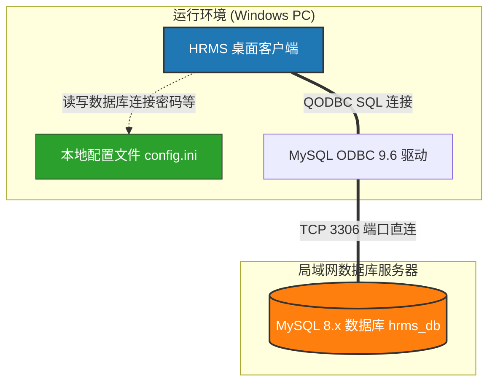
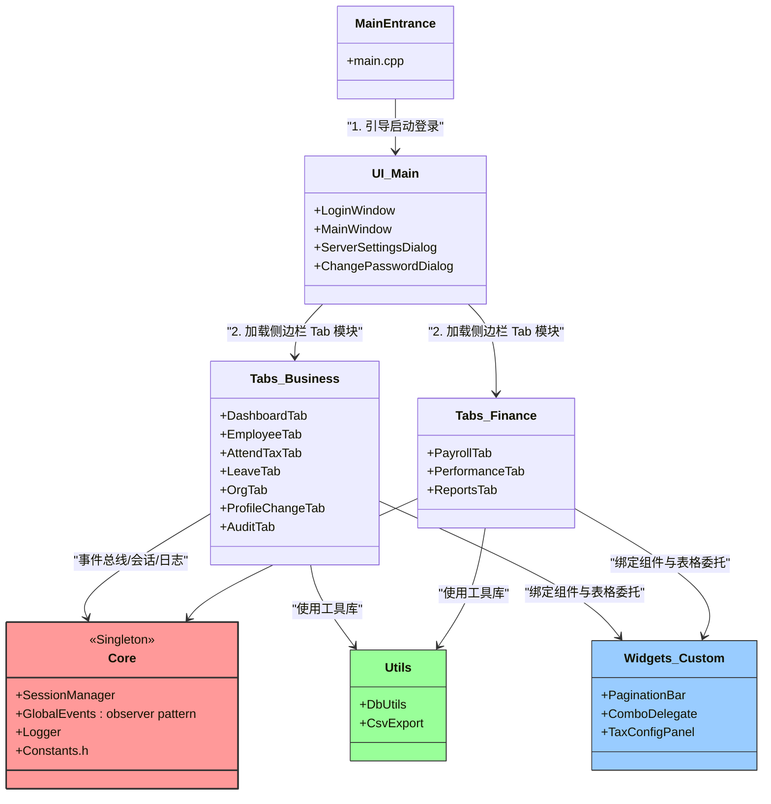
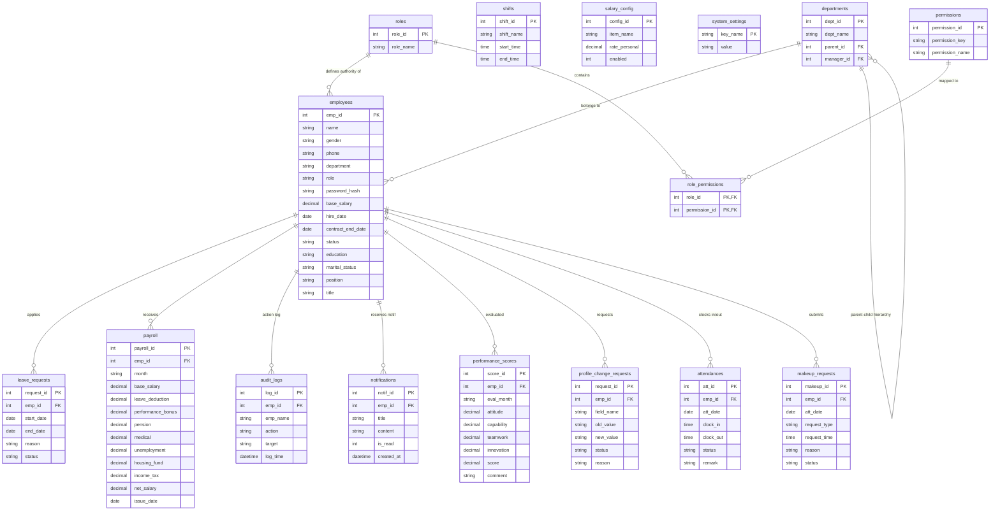
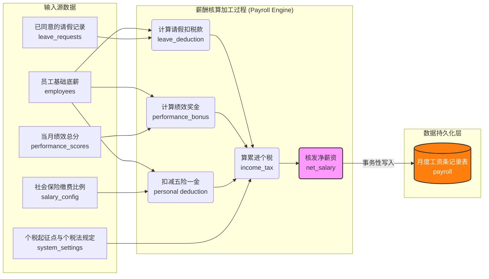
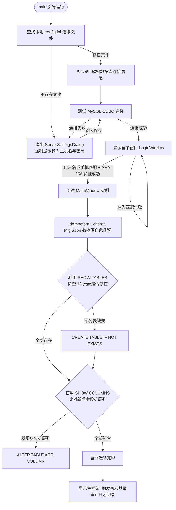
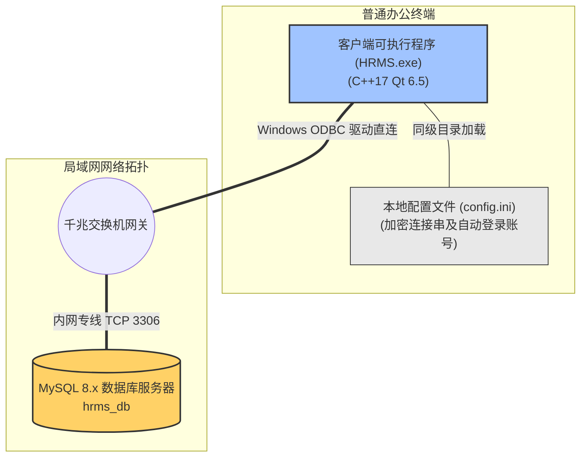

# 人力资源管理系统 (HRMS) — 软件架构设计说明书 (SAD)

> **标准符合性声明**：本说明书参考软件架构描述的最新国际标准 **ISO/IEC/IEEE 42010:2011(E)** 进行编写，旨在从多视角、多维度系统地描述系统架构设计，确保利益相关者的架构关注点得到全面解决。
>
> **版本**：V1.0 (初稿)  
> **日期**：2026-05-22  
> **项目代号**：HRMS  

---

## 目录

1. [引言与文档标识](#1-引言与文档标识)
2. [利益相关者与架构关注点](#2-利益相关者与架构关注点)
3. [架构视角与视图定义](#3-架构视角与视图定义)
   - [3.1 逻辑视角与视图 (Logical View)](#31-逻辑视角与视图-logical-view)
   - [3.2 数据视角与视图 (Data View)](#32-数据视角与视图-data-view)
   - [3.3 运行过程视角与视图 (Process View)](#33-运行过程视角与视图-process-view)
   - [3.4 部署视角与视图 (Deployment View)](#34-部署视角与视图-deployment-view)
   - [3.5 安全视角与视图 (Security View)](#35-安全视角与视图-security-view)
4. [架构元素对应与一致性分析](#4-架构元素对应与一致性分析)
5. [架构决策与决策合理性说明 (Architecture Rationale)](#5-架构决策与决策合理性说明-architecture-rationale)

---

## 1. 引言与文档标识

### 1.1 文档目的

本文档针对 **人力资源管理系统 (HRMS)** 进行系统性的架构定义与描述。它作为项目开发人员、系统维护者、课程评审老师以及后续扩展者的核心参考指南，用以说明整个系统是如何组织的、核心逻辑块如何交互以及为什么做出相应的技术选择。

### 1.2 系统范围与定位

HRMS 是一套基于 **C++/Qt6/MySQL** 的桌面端企业级人力资源管理系统，主要包括：员工档案CRUD与批量调整、考勤打卡、补卡与请假审批、多维度绩效评分、一键自动薪酬核算、组织架构树呈现、多维统计报表、未读通知推送以及全局安全操作审计日志等功能。该系统部署于局域网或单机环境，不面向高并发、外网或移动端场景。

### 1.3 架构上下文

系统处于典型的客户端/服务器 (Client/Server, C/S) 上下文中。客户端直接通过 Windows 操作系统下的 ODBC (QODBC) 数据源驱动程序与局域网内的 MySQL 数据库直连，无须中间件或专门的应用服务器。



### 1.4 参考标准

* **ISO/IEC/IEEE 42010:2011(E)** — Systems and software engineering — Architecture description.
- **HRMS 软件需求规格说明书 (SRS) V3.0** — 包含核心需求与数据定义。

---

## 2. 利益相关者与架构关注点

根据 IEEE 42010 标准，架构描述应明确识别系统各利益相关者（Stakeholders）及其特有的关注点（Concerns），并通过不同的架构视图分别予以应对。

### 2.1 利益相关者识别

1. **普通员工 (User)**：系统基层使用者，执行个人考勤、请假、基本信息修改申请、查询个人工资等。
2. **管理员/HR (Admin)**：系统管理人员，负责全员档案维护、审批流转、绩效评定、一键薪酬核算、组织调整及安全日志追溯。
3. **开发人员 (Developer)**：编写系统代码的软件工程师，关注系统代码解耦、接口定义和可维护性。
4. **系统维护人员 (Maintainer)**：系统生命周期后期的部署、维护和升级人员，关注数据库自动表迁移与配置自愈。
5. **课程评审指导老师 (Acquirer)**：从工程规范性、数据库范式和架构设计的完备性角度评估系统的评估者。

### 2.2 架构关注点定义

* **[F-1] 功能完整性 (Functionality)**：全业务闭环，数据正确展示。
- **[S-1] 系统安全性 (Security)**：系统防 SQL 注入，密码和连接配置等敏感数据安全保护。
- **[M-1] 可维护性与可扩展性 (Modifiability & Evolvability)**：架构分层合理，界面刷新解耦，数据库迁移简易。
- **[P-1] 性能与响应时间 (Performance)**：冷启动时间、复杂报表图表渲染及批量薪资核算响应时间。
- **[U-1] 可用性与容错能力 (Usability & Reliability)**：防误操作（支持事务和批量撤销），防止因未选中行引发的非法指针崩溃。
- **[D-1] 数据一致性 (Data Integrity)**：计薪过程数据强一致性，以及多 Tab 窗口数据同步。

### 2.3 利益相关者与架构关注点矩阵

本架构通过为不同的关注点建立相应的架构视图来建立对应关系：

| 利益相关者 | 核心关注点 | 架构映射应对的视图 |
| :--- | :--- | :--- |
| **普通员工 (User)** | 功能完整性 [F-1]、可用性 [U-1] | 逻辑视图、安全视图（控制自身数据可见范围） |
| **管理员 (Admin)** | 功能完整性 [F-1]、安全性 [S-1]、数据一致性 [D-1] | 数据视图、逻辑视图、安全视图、过程视图（数据一致性） |
| **开发人员 (Developer)** | 可维护性 [M-1]、数据一致性 [D-1] | 逻辑视图（类设计与解耦）、数据视图（实体与代码模型映射） |
| **系统维护者 (Maintainer)** | 可维护性 [M-1]、性能 [P-1]、容错能力 [U-1] | 过程视图（表自愈）、部署视图、安全视图 |
| **评审导师 (Acquirer)** | 全部关注点，特别是架构合理性、数据规范性 | 所有视图及架构决策说明 (Rationale) |

---

## 3. 架构视角与视图定义

为全面展现 HRMS 的系统架构，本 SAD 设计了五大视图。

### 3.1 逻辑视角与视图 (Logical View)

逻辑视角描述了系统内部软件的分层与静态组织结构，是面向开发人员的最核心视图。

#### 3.1.1 逻辑架构设计原则 (Model-View-Delegate + EventBus)

系统在核心架构上严格遵循 **模型-视图 (Model-View)** 模式。通过继承 Qt 内置的模型类，与 QTableView 等视图控件进行绑定。

1. **View 层 (视图)**：由各 `ui/` 和 `tabs/` 类实现，负责控件渲染与用户交互。
2. **Model 层 (模型)**：使用 `QSqlTableModel` 和 `QSqlRelationalTableModel` 承载，处理内存中与 MySQL 表对应的数据缓冲及事务修改。
3. **Delegate 层 (委托)**：使用自定义的 `ComboDelegate` 在表格单元格中嵌入下拉框控件，规范输入。
4. **全局事件总线 (EventBus)**：`GlobalEvents` 实现了**观察者模式**。它作为解耦器，任何 Tab 完成提交修改（如审批请假、修改员工信息等）后发射 `dataChanged` 或 `auditRefresh` 信号，其他独立 Tab 监听此信号自动拉取最新数据，避免了 Tab 组件间的强指针依赖。

#### 3.1.2 模块及类静态关系模型

下图展示了系统主要源码文件的模块划分与调用依赖关系：



### 3.2 数据视角与视图 (Data View)

数据视角面向数据库设计与数据持久化，是系统数据流向和实体间关联的核心视图。

#### 3.2.1 数据库物理设计 (E-R图)

系统内置的 16 张数据表结构符合第三范式 (3NF)（审计表在姓名上做了冗余反规范化除外）。关系模型如下：



#### 3.2.2 核心业务数据流：请假-绩效-薪酬核算引擎 (DFD)

系统的关键计薪业务由考勤打卡状态、已审批请假单、当月绩效总分、社保缴费比例和累进个税起征点共同影响。数据流向如下图所示：



### 3.3 运行过程视角与视图 (Process View)

过程视角侧重于描述系统在运行期间的控制流、启动引导流程以及多系统并发事务交互的时序。

#### 3.3.1 系统启动自愈引导流 (Idempotent Schema Migration)

为了实现零运维成本和自动升级，系统启动时会自动对本地和远程数据库做自愈迁移检测，流程如下：



#### 3.3.2 登录身份认证与权限过滤时序 (Sequence Diagram)

当用户尝试登录并加载主窗口时，系统自动进行用户身份鉴权与基于角色的侧边栏控件过滤：

```mermaid
sequenceDiagram
    autonumber
    actor User as "用户 (Admin/User)"
    participant LWin as 登录窗口 LoginWindow
    participant DB as MySQL 数据库
    participant MWin as 主窗口 MainWindow
    participant EventBus as 全局事件总线 GlobalEvents

    User ->> LWin: 输入账号(手机号)及密码, 点击登录
    LWin ->> LWin: 将密码生成 SHA-256 哈希字符串
    LWin ->> DB: 准备参数化 SQL 查询符合条件记录 (prepare + bindValue)
    activate DB
    DB -->> LWin: 返回匹配的员工记录 (包含 emp_id, name, role)
    deactivate LWin
    deactivate DB
    
    Note over LWin: 验证通过, 提取用户角色 role
    LWin ->> MWin: 实例化主窗口 (传入 empId, 姓名, 角色)
    activate MWin
    MWin ->> EventBus: 绑定各子标签页数据变更刷新槽函数
    MWin ->> MWin: 根据角色设置侧边栏可见性 (RBAC 界面过滤)
    Note over MWin: 若角色为普通用户 (user)<br/>则对首页/员工/组织/日志/审批/计薪等菜单执行 hide()
    MWin ->> DB: 对考勤与薪酬表过滤过滤条件绑定为 emp_id = 当前用户
    MWin ->> DB: 自动向 audit_logs 插入用户成功登录日志
    MWin -->> User: 呈现定制化的 HRMS 系统操作主界面
    deactivate MWin
```

### 3.4 部署视角与视图 (Deployment View)

部署视角显示了系统的物理拓扑架构、软件安装要求以及运行时在物理设备上的分布。

#### 3.4.1 物理部署架构拓扑

系统采用局域网轻量两层客户端服务器模型：

- **硬件部署**：
  - **客户端节点 (PC)**：标准办公室 Windows 操作系统主机。安装有 `HRMS.exe` 二进制客户端文件。
  - **数据库服务器**：局域网中某台独立运行 MySQL 8.x 的硬件服务器（也可以是内网虚拟机或本机）。
- **网络通信**：
  - **协议**：TCP/IP 上层的 ODBC 数据库直接通信连接。
  - **端口**：3306（MySQL 标准服务监听端口）。
  - **文件系统依赖**：`HRMS.exe` 在启动时必须读取同目录下的 `config.ini`，以获取 Base64 编码的敏感凭据。



### 3.5 安全视角与视图 (Security View)

安全视角着重于系统的防御性设计，解决利益相关者关于防注入漏洞、防窥探和越权访问的安全性关注点 [S-1]。

#### 3.5.1 RBAC 权限控制矩阵

系统在客户端界面和数据库数据查询层实现了严格的基于角色的访问控制 (RBAC) 隔离。系统的角色和权限完全由数据库动态驱动，支持系统预设的默认角色（`admin`, `user`）以及由管理员动态创建的自定义角色（如 `HR`, `Manager` 等）。

系统的访问控制矩阵通过 17 项原子权限（如 `view_dashboard`, `manage_employees`, `approve_leave`, `calculate_payroll` 等）实现细粒度控制。其访问控制配置如下表所示：

| 系统模块 / 功能菜单 | 所需原子权限 | 管理员角色 (admin) 权限 | 普通员工角色 (user) 权限 | 实现与过滤机制 |
| :--- | :--- | :--- | :--- | :--- |
| **仪表盘/合同到期** | `view_dashboard`, `view_reports` | **全部可见** | **部分可见**（仅仪表盘，隐藏报表） | 侧边栏及 subTabWidget 动态加载过滤 |
| **员工档案管理 (CRUD)** | `manage_employees` | **全部可见** | **直接隐藏** | 侧边栏/子标签页级屏蔽，动态构建导航树 |
| **打卡补卡审批** | `approve_makeup` | 拥有审批权限（同意/拒绝所有员工） | 仅能对自己发起打卡与补卡申请 | SQL 级别过滤绑定 `WHERE emp_id = :curId` |
| **请假审批** | `approve_leave` | 拥有全局审批权限 | 仅能对自己发起请假与查询请假状态 | UI层隐藏审批按钮，拦截后台审批逻辑槽函数 |
| **薪酬核算大盘** | `calculate_payroll` | 可用（“一键核算全员薪资”） | **直接隐藏** | 屏蔽核算按钮，员工仅能看个人历史工资条 |
| **绩效评分提交** | `evaluate_performance` | 可用（对全员进行评分录入） | **直接隐藏** | 屏蔽评分表单，拦截提交逻辑槽函数 |
| **操作审计日志** | `view_audit_logs` | 可看（全量时间倒序日志） | **直接隐藏** | 菜单级屏蔽，不挂载相关模型类 |
| **权限管理 (RBAC)** | `manage_rbac` | 可用（动态增删角色、勾选权限） | **直接隐藏** | 侧边栏彻底隐藏，拒绝无权限访问 |

系统在用户登录成功后，通过 `SessionManager::reloadPermissions()` 将当前角色拥有的所有权限 Key 缓存至内存 `QSet` 中，各 UI 模块和数据模型层在渲染和查询前调用 `SessionManager::instance()->hasPermission("perm_key")` 进行实时越权拦截。当管理员在 `🔑 权限` 面板中更新某角色权限并保存时，若当前登录用户属于该角色，将自动触发内存权限缓存的实时刷新。

#### 3.5.2 防御性安全设计

1. **SQL 注入防护 (Parameterized Queries)**：系统在所有涉及外部变量的数据库交互中，杜绝使用字符串拼接 SQL 的做法，统一采用 Qt 的 `prepare()` 以及 `bindValue()` 进行参数占位绑定，利用数据库驱动在底层转义，阻断注入式代码。
2. **安全散列算法 (SHA-256 Hashing)**：员工在系统中的登录密码绝不以明文存储在 `employees` 表的 `password_hash` 字段中。系统在注册和修改密码时对其进行 SHA-256 加密后再行存取。登录比对也是比对密码的 SHA-256 散列值。
3. **配置文件敏感数据编码 (Base64 protection)**：为了防止运维人员在服务器共享或直接拷贝 config.ini 时导致生产数据库用户名与密码泄露，配置文件中存储的连接串信息使用 Base64 进行遮蔽混淆。

---

## 4. 架构元素对应与一致性分析

根据 ISO/IEC/IEEE 42010 标准，系统必须在多个视图的描述项之间建立一致性对应规则 (Correspondence Rules)，确保不同视角的架构设计互相契合，不产生逻辑冲突。

### 4.1 视图间对应规则

1. **Logical-to-Data 对应规则**：逻辑视图（C++ 代码类）中的各业务 Tab 类（如 `EmployeeTab`、`LeaveTab`、`PayrollTab`）必须与数据视图（E-R图）中的物理表（`employees`、`leave_requests`、`payroll`）建立强对应的映射。每一个 Tab 类对数据库的操作必须在 E-R 图关联范围之内，严禁越权直接操作无关表。
2. **Process-to-Data 对应规则**：在运行过程视图中定义的数据库自愈迁移（Idempotent Schema Migration）表序列必须严格涵盖数据视图（E-R图）中出现的全部 13 张表结构，确保系统在首次运行或补全字段时能自动初始化数据结构。
3. **Deployment-to-Process 对应规则**：物理部署视图中加载的 `config.ini` 参数必须作为运行过程视图中引导流程（main 引导）的直接入参输入，保证连接链路能够成功建立。

### 4.2 架构冲突与折中分析 (Refactoring & Anti-Normalization)

在架构审查过程中，我们发现并接受了以下**折中决策**：
- **审计日志表 (`audit_logs`) 的反规范化设计**：为了保证操作追溯的真实性与查询效率，`audit_logs` 表除了存储操作人编号 `emp_id`，还以 `emp_name` 字段直接冗余了操作发生时该员工的姓名。
- **一致性冲突**：这违背了关系型数据库第三范式 (3NF) 的设计要求（因为 `emp_name` 传递依赖于 `emp_id`）。
- **折中理由**：如果不冗余姓名，在员工姓名修改后，历史日志关联查询出的姓名会被错误地更新为新值（导致历史追溯失真）；且审计日志页面需要高频读取并以极快速度进行数据绑定。使用多表外键联查 (Join) 在日志数量极大时会导致查询响应时间变慢。因此，反规范化设计能有效折中解决**可审计性 (Auditability)** 与 **性能 [P-1]** 的诉求。

---

## 5. 架构决策与决策合理性说明 (Architecture Rationale)

在 HRMS 的架构开发中，围绕系统的环境约束和核心质量指标，我们做出了以下四个关键技术决策，并在此处给出其合理性理由解释。

### 决策 1：选用二层 C/S 直连架构，摒弃三层 (B/S 或带有 Java/Go 后端的 C/S) 架构

* **问题描述**：为中小企业或实验室课程设计开发人力资源系统，是应该选择标准的 B/S 架构，还是采用两层 C/S 直连数据库？
- **架构决策**：选用二层 C/S 直连架构（Qt widgets 客户端通过 QODBC 驱动直连 MySQL 服务端）。
- **决策合理性**：
    1. **极低的开发与运维成本**：局域网桌面应用场景下，没有并发压力。如果引入 Java/Go 后端服务器，将增加近一倍的接口编写工作量，同时产生高昂的服务器部署、环境配置与网络延迟。
    2. **极高的数据绑定性能**：Qt 6 SQL 模块专门为二层架构进行了极致优化。利用其自带的 `QSqlTableModel`，可以与 UI 组件 `QTableView` 建立实时数据管道。表格修改、行删除、分页缓冲均可以在几行 C++ 代码内完成，完美贴合财务和HR人员像使用 Excel 一样双击即改、批量撤销的可用性关注点 [U-1]。

### 决策 2：跨窗口标签页采用单例事件总线 `GlobalEvents` (观察者模式) 进行解耦

* **问题描述**：当管理员在“考勤 Tab”中同意了一条补卡申请，或者在“请假 Tab”同意了请假申请，需要让“首页仪表盘 Tab”自动刷新数据徽标，同时需要让“薪酬核算 Tab”重新加载扣款基数。若直接在 Tab 类中持有其他 Tab 的指针，会产生极其严重的类循环包含（Circular Dependency），导致代码无法编译和维护难度呈指数上升。
- **架构决策**：定义全局单例事件总线 `GlobalEvents`，在数据变更的 Tab 中发射相应的信号（如 `dataChanged()`），由需要刷新数据的 Tab 在其构造槽函数中监听并绑定该全局事件信号。
- **决策合理性**：
  - **架构完全解耦**：所有 Tab 之间实现了零依赖关系。任何 Tab 的修改或删除都不影响其他 Tab 类的编译，开发维护性 [M-1] 得到根本保障。
  - **避免脏数据**：观察者模式确保了用户在一个 Tab 进行审批后，全标签页视图在视觉上立刻刷新，杜绝了由于视图缓冲造成的“脏数据视觉体验”。

### 决策 3：引入防呆式的输入数据校验与空行操作拦截

* **问题描述**：在 QTableView 关联 TableModel 进行动态编辑和保存时，若操作员选中空行、提交非法字符或越界数字，极易引发底层 SQL 驱动报错甚至内存非空指针野指针崩溃。
- **架构决策**：在 `EmployeeTab` 等组件中对“删除行”、“修改在职状态”、“同意审批”等按钮的触发动作进行置空安全判断拦截，禁止在没有选中有效行时执行操作；在社保和薪酬配置部分，使用 `QDoubleSpinBox` 滑块限制输入上下限。
- **决策合理性**：
  - **系统鲁棒性**：保护程序不因误操作和极端输入产生指针异常崩溃，降低因内存泄露或段错误退出的概率，提升可用性指标 [U-1]。

### 决策 4：本地配置文件 `config.ini` 使用 Base64 进行连接凭证遮蔽

* **问题描述**：如果将 MySQL 数据库的登录用户名与密码直接以明文写入本地 `config.ini` 文件中，一旦被电脑前的闲杂人员以记事本打开，便会导致后台数据库被不法人员脱库，产生极大的数据泄露风险。
- **架构决策**：系统在保存连接参数时，对密码等敏感字符串执行 Base64 编码，再存入 `config.ini` 文件中。读取时再由程序还原。
- **决策合理性**：
  - **折中的安全性保障**：虽然 Base64 是可逆的对称混淆，并不具备高强度密码防破解能力。但是在内网和局域网教研室物理环境下，它足以有效杜绝周围人“肉眼余光窥探”与不经意的记事本误读。此方案以接近于零的算法开销，低成本地为局域网 C/S 桌面客户端提供了第一道视觉级防御屏障。
