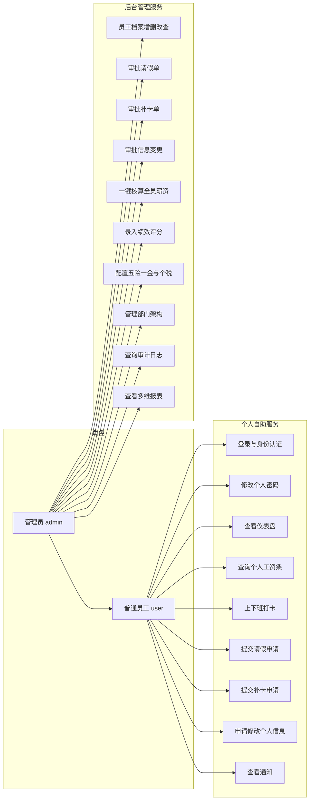
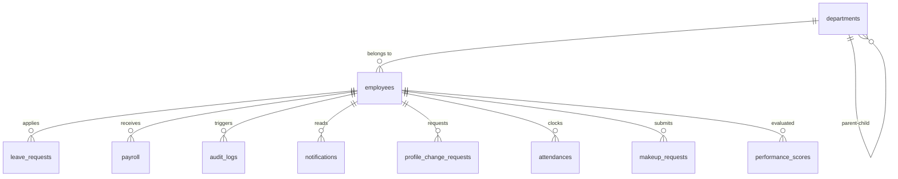
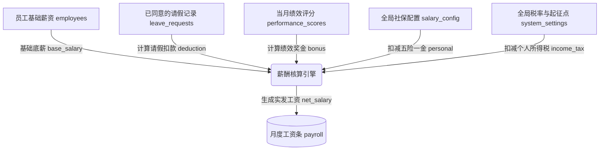

# 人力资源管理系统 — 软件需求规格说明书 (SRS)

> 版本：V3.5
> 日期：2026-06-10
> 项目代号：HRMS

---

## 目录

- [1 引言](#1-引言)
- [2 总体描述](#2-总体描述)
- [3 具体需求](#3-具体需求)
- [4 附录](#4-附录)

---

## 1 引言

### 1.1 目的

本文档旨在完整定义 **人力资源管理系统 (HRMS)** 的软件需求规格。目标读者包括：

- **开发人员**：作为编码、联调与验收检查的依据
- **课程指导教师**：作为评审与打分的参考基线
- **后续维护者**：作为系统修改与扩展的需求溯源

### 1.2 范围

HRMS 是一套基于 C/S 架构的桌面端人事管理软件，覆盖以下业务域：

1. **仪表盘首页**：关键指标概览卡片、合同到期提醒
2. **员工档案管理**：员工基本信息的录入、修改、删除与多维查询，支持 CSV 导出与批量调部门
3. **信息变更审批**：员工申请修改个人信息字段，管理员审批后自动更新
4. **考勤打卡**：上下班打卡（迟到/早退自动判定）+ 补卡申请与审批
5. **请假管理**：员工请假申请提交与管理层审批流转
6. **薪酬核算**：基于考勤数据、绩效评分、五险一金、累进个税自动计算月度工资
7. **绩效评分**：四维度评分，结果联动薪酬核算的绩效奖金
8. **组织架构**：部门树管理（层级、负责人）、部门员工列表、岗位职称与薪资标准维护
9. **统计报表**：10 种图表可视化 + hover 明细提示 + PDF 明细报表导出
10. **操作审计**：全操作日志追踪
11. **通知中心**：审批结果自动推送，铃铛未读提示
12. **角色权限隔离**：管理员与普通员工的功能与数据可见性区分

系统定位为单机 + 局域网 MySQL 数据库的轻量级部署，不涉及分布式、高并发或移动端场景。

### 1.3 定义、首字母缩写词与缩略语

| 术语 | 定义 |
|------|------|
| HRMS | Human Resource Management System，人力资源管理系统 |
| RBAC | Role-Based Access Control，基于角色的访问控制 |
| QODBC | Qt Open Database Connectivity，Qt 的 ODBC 数据库驱动 |
| C/S | Client/Server，客户端/服务器架构 |
| 管理员 (admin) | 拥有全部功能权限与全量数据可见性的系统角色 |
| 普通员工 (user) | 仅可查看自身数据、发起申请的系统角色 |
| 五险一金 | 中国法定社会保险与住房公积金：养老、医疗、失业、工伤、生育保险 + 住房公积金 |

### 1.4 参考文献

- 《可行性分析报告.md》— 项目可行性论证
- IEEE 830-1998 — 软件需求规格说明书推荐实践
- Qt 6.5 官方文档 — https://doc.qt.io/qt-6/

---

## 2 总体描述

### 2.1 产品视角

```
┌──────────────────────────────────────────────────────────────┐
│                      HRMS 桌面客户端                          │
│  ┌──────────┐ ┌──────────────┐ ┌───────────────────────────┐ │
│  │ 登录窗口  │ │   主窗口      │ │ 侧边栏 (8 项) + 子标签页   │ │
│  │          │ │  (QMainWin)  │ │ + 通知铃铛 + 系统菜单       │ │
│  └──────────┘ └──────────────┘ └───────────────────────────┘ │
│        │              │             │                         │
│        └──────────────┴─────────────┘                         │
│                       │ QODBC                                  │
└───────────────────────┼───────────────────────────────────────┘
                        │
               ┌────────┴────────┐
               │   MySQL 8.x     │
               │   hrms_db       │
               │  ┌───────────┐  │
               │  │ 17 张表    │  │
               │  └───────────┘  │
               └─────────────────┘
```

系统为典型 **两层 C/S 架构**：Qt Widgets 客户端 + MySQL 服务端。客户端通过 QODBC 驱动与数据库直连，无中间应用服务器。

### 2.2 产品功能

| 编号 | 功能模块 | 优先级 | 状态 | 简述 |
|------|---------|--------|------|------|
| F1 | 用户登录与认证 | 高 | 已实现 | 姓名或手机号 + SHA-256 密码登录；记住密码/自动登录；服务端配置 |
| F2 | 仪表盘首页 | 高 | 已实现 | 6 项统计卡片 + 合同到期提醒 + 统计图表 |
| F3 | 员工信息管理 | 高 | 已实现 | CRUD + 多维筛选 + CSV 导出 + 批量调部门 + 状态流转；姓名、岗位、职称与薪资联动校验 |
| F4 | 信息变更审批 | 高 | 已实现 | 员工申请修改个人信息 → 管理员审批 → 自动更新；记录审批人、审批时间和审批意见 |
| F5 | 考勤打卡 | 高 | 已实现 | 上下班打卡（迟到/早退判定）+ 补卡申请与审批 |
| F6 | 请假申请与审批 | 高 | 已实现 | 员工提交请假 → 管理员同意/拒绝，支持批量审批、审批意见与通知自动推送 |
| F7 | 薪酬核算 | 高 | 已实现 | 一键核算：基础工资 + 绩效奖金 - 请假扣款 - 五险一金 - 累进个税 |
| F8 | 绩效评分 | 中 | 已实现 | 四维度百分制评分，结果联动薪酬绩效奖金 |
| F9 | 组织架构管理 | 中 | 已实现 | 部门层级管理、负责人指派、部门员工列表、岗位薪资标准维护；包含拖拽缩放的交互式可视化树状图 |
| F10 | 动态权限隔离 (RBAC) | 高 | 已实现 | 数据库驱动角色/权限映射 + Centralized Session 缓存 + UI过滤与数据级防护 |
| F11 | 工资查询 | 中 | 已实现 | 员工查看个人历史工资条（含五险一金明细）；管理员可按月份或输入姓名查询某个员工工资条 |
| F12 | 统计报表 | 中 | 已实现 | 10 种图表（饼图/柱状图/折线图）+ 饼图高区分度配色 + hover 全名提示 + PDF 明细报表导出 |
| F13 | 操作审计日志 | 中 | 已实现 | 11 类操作全量记录，按时间倒序查看 |
| F14 | 通知中心 | 中 | 已实现 | 铃铛图标 + 5秒实时后台轮询 + 未读计数 + 铃铛闪烁动画 + 一键标已读 |
| F15 | 五险一金配置 | 中 | 已实现 | 管理员可配置各项社保个人缴费比例 |
| F16 | 全局事件总线 | 低 | 已实现 | 观察者模式，数据变更时所有标签页自动刷新 |
| F17 | 用户密码修改 | 低 | 已实现 | 旧密码验证 + SHA-256 新密码更新 |
| F18 | 自主找回密码 | 中 | 已实现 | 通过在职员工工号、姓名、预留手机号多维身份校验，安全重置密码 |

### 2.3 用户特征

| 角色 | 技术熟练度 | 典型操作频率 | 职责范围 |
|------|-----------|-------------|---------|
| 管理员 (admin) | 中等，熟悉办公软件 | 每日 | 管理全部员工档案、审批请假/补卡/信息变更、核算薪资、配置社保、查看报表与日志 |
| 普通员工 (user) | 基础，仅需点击操作 | 每月数次 | 查看个人信息与工资、打卡签到、提交请假/补卡/信息变更申请、修改密码 |

#### 2.3.1 系统用例图 (Use Case Diagram)



### 2.4 约束

- **技术约束**：C++17 + Qt 6.5 + MySQL 8.x + MinGW 64-bit (Windows)
- **部署约束**：客户端与数据库必须在同一局域网内，不支持公网部署
- **安全约束**：SQL 全程参数化查询防注入；密码采用 SHA-256 哈希存储；config.ini 数据库密码 Base64 编码
- **许可约束**：Qt 使用 LGPL v3 开源版，仅用于教学与非商业用途

### 2.5 假设与依赖

- 假设 MySQL 服务已安装并运行在局域网可达的 IP（或本机）
- 假设 `hrms_db` 数据库已创建，17 张表通过启动迁移自动创建
- 假设 MySQL ODBC 驱动 (9.6 UNICODE) 已在 Windows 上正确注册
- 假设操作系统中文字体已安装，界面中文无乱码
- 数据库连接参数通过 `config.ini` 外部配置，支持运行时修改

---

## 3 具体需求

### 3.1 外部接口需求

#### 3.1.1 用户界面

**登录窗口 (LoginWindow)**

| 元素 | 类型 | 说明 |
|------|------|------|
| 账号输入框 | QLineEdit | 接受姓名或手机号 |
| 密码输入框 | QLineEdit (Password) | 输入回显为掩码字符 |
| 记住密码复选框 | QCheckBox | 勾选后密码 Base64 编码存入 config.ini |
| 登录按钮 | QPushButton | 触发身份验证 |
| 数据库设置链接 | QLabel/QPushButton | 弹出服务器设置对话框 |

**服务器设置对话框 (ServerSettingsDialog)**

| 元素 | 类型 | 说明 |
|------|------|------|
| 驱动下拉框 | QComboBox | ODBC 驱动选择 |
| 服务器输入框 | QLineEdit | 数据库主机地址 |
| 端口输入框 | QLineEdit | 数据库端口号 |
| 数据库名输入框 | QLineEdit | 数据库名称 |
| 用户名输入框 | QLineEdit | 数据库用户名 |
| 密码输入框 | QLineEdit (Password) | 数据库密码 |
| 扫描局域网按钮 | QPushButton | TCP 端口扫描发现 MySQL 服务 |
| 测试连接按钮 | QPushButton | 验证数据库连接参数 |
| 保存按钮 | QPushButton | 写入 config.ini |

**主窗口 (MainWindow)** — 侧边栏导航 + 内容区 + 系统菜单 + 通知铃铛 + 状态栏：

**侧边栏导航 (8 项)：**

| 侧边栏项 | 图标 | 可见角色 | 包含子标签页 |
|---------|------|---------|-------------|
| 首页 | 房屋 | admin | 仪表盘 + 统计图表 |
| 员工 | 人物 | 按权限显示 | 员工管理 + 信息变更申请/审批 |
| 我的考勤 | 闹钟 | 全部 | 打卡 + 请假申请 + 补卡申请 |
| 考勤管理 | 图表 | admin | 考勤面板 + 审批中心 |
| 薪酬 | 钱袋 | 全部 | 工资条 + 绩效评分 + 社保配置 |
| 组织 | 建筑 | admin | 部门树 + 员工列表 + 部门信息 + 岗位薪资标准 + 组织架构图 |
| 日志 | 卷轴 | admin | 审计日志 |
| 权限 | 钥匙 | admin | 角色管理 + 权限分配 |

**子标签页内容：**

*首页 → 仪表盘*

| 元素 | 类型 | 说明 |
|------|------|------|
| 统计卡片区 | QHBoxLayout | 6 张卡片：总人数、在职数、非在职数、本月请假数、待审批数、本月工资总额 |
| 合同到期提醒 | QLabel | 标记 30 天内合同到期员工，红色预警 |
| 提醒列表 | QListWidget | 列出即将到期员工的姓名与日期 |

*首页 → 统计图表*

与下方"统计报表"子标签页功能相同（10 种图表），此处为快速访问入口；饼图扇区悬停时显示完整分类名称、数量和占比，避免部门名称过长时只能看到截断图例。

*员工 → 员工管理*

| 元素 | 类型 | 说明 |
|------|------|------|
| 筛选栏 | QHBoxLayout | 部门 / 状态 / 姓名 / 婚姻状况 / 学历 / 岗位 组合筛选 + 查询/重置按钮 |
| 员工表格 | QTableView | 绑定 QSqlTableModel，隐藏密码列，双击可编辑 |
| 列委托 | ComboDelegate | 性别/角色/状态/学历/婚姻状况列使用下拉选择 |
| 岗职薪资联动 | ComboDelegate + EmployeeService | 根据部门动态限制岗位、职称和基础薪资范围；切换岗位/职称后自动带出默认薪资 |
| 添加员工按钮 | QPushButton | 表尾插入空行，默认密码 123456 的 SHA-256 哈希 |
| 删除选中行按钮 | QPushButton | 标记删除当前选中行（需手动保存） |
| 撤销修改按钮 | QPushButton | 放弃所有未提交修改 |
| 保存修改按钮 | QPushButton | 批量提交所有修改到数据库 |
| 标记离职/在职按钮 | QPushButton | 动态切换选中员工的在职状态 |
| 批量调部门按钮 | QPushButton | 为多选行统一设置部门 |
| 导出 CSV 按钮 | QPushButton | 导出表格为 UTF-8 BOM CSV（跳过密码列） |
| 分页栏 | PaginationBar | 上一页/下一页分页控件 |

*员工 → 信息变更审批*

| 元素 | 类型 | 说明 |
|------|------|------|
| 变更申请表格 | QTableView | 查看所有变更申请（字段/原值/新值/状态/审批人/审批时间/审批意见） |
| 申请变更按钮 | QPushButton | 员工选择字段并填写新值提交申请 |
| 同意按钮 | QPushButton | 仅 admin 可见，同意后直接更新 employees 表 |
| 拒绝按钮 | QPushButton | 仅 admin 可见 |

*我的考勤 (MyAttendanceTab)*

| 元素 | 类型 | 说明 |
|------|------|------|
| 实时时钟 | QLabel | 显示当前日期与时间 |
| 上班打卡按钮 | QPushButton | 记录上班签到时间，自动判定迟到（>09:00） |
| 下班打卡按钮 | QPushButton | 记录下班签退时间，自动判定早退（<18:00） |
| 打卡记录表格 | QTableView | 显示日期/上班时间/下班时间/状态 |
| 班次信息 | QLabel | 显示当前班次时间段 |
| 请假-开始日期 | QDateEdit | 带日历弹窗 |
| 请假-结束日期 | QDateEdit | 带日历弹窗 |
| 请假-事由输入框 | QLineEdit | 自由文本 |
| 我要请假按钮 | QPushButton | 提交请假申请 |
| 请假记录表格 | QTableView | 显示个人请假历史及审批状态 |
| 补卡-日期选择器 | QDateEdit | 选择需补卡的日期 |
| 补卡-类型下拉框 | QComboBox | 上班补签 / 下班补签 |
| 补卡-时间选择器 | QTimeEdit | 补签的具体时间 |
| 补卡-原因输入框 | QLineEdit | 补签原因说明 |
| 提交补卡按钮 | QPushButton | 提交补卡申请 |

*考勤管理 (AttendManageTab)*

| 元素 | 类型 | 说明 |
|------|------|------|
| 考勤面板-筛选栏 | QHBoxLayout | 按日期/姓名/状态组合筛选 + 查询/重置按钮 |
| 考勤面板-记录表格 | QTableView | 显示全员打卡记录，支持 CSV 导出 |
| 审批中心-请假审批 | QTableView | 待审批请假单列表，含单条/批量同意、单条/批量拒绝 |
| 审批中心-补卡审批 | QTableView | 待审批补卡单列表，含单条/批量同意、单条/批量拒绝 |
| 同意按钮 | QPushButton | 仅 admin 可见，可填写审批意见；同意后更新对应记录并发送通知 |
| 拒绝按钮 | QPushButton | 仅 admin 可见，必须填写拒绝原因；拒绝后发送通知 |

*薪酬 → 工资条*

| 元素 | 类型 | 说明 |
|------|------|------|
| 工资条表格 | QTableView | 显示月份/基础工资/请假扣款/绩效奖金/五险一金各项/个税/实发工资，只读 |
| 月份筛选 | QComboBox | 按工资月份查询工资条 |
| 员工姓名查询 | QLineEdit | 管理员可输入姓名查询匹配员工的工资条，普通员工固定查看本人数据 |
| 一键核算按钮 | QPushButton | 仅 admin 可见，触发当月薪资批量计算 |
| 导出 CSV 按钮 | QPushButton | 导出工资条为 CSV |

*薪酬 → 绩效评分*

| 元素 | 类型 | 说明 |
|------|------|------|
| 员工选择下拉框 | QComboBox | 选择被评价员工 |
| 月份选择器 | QDateEdit/QComboBox | 选择评价月份 |
| 工作态度滑块/输入 | QDoubleSpinBox | 0-25 分 |
| 专业能力滑块/输入 | QDoubleSpinBox | 0-25 分 |
| 团队协作滑块/输入 | QDoubleSpinBox | 0-25 分 |
| 创新能力滑块/输入 | QDoubleSpinBox | 0-25 分 |
| 评语输入框 | QTextEdit | 可选评语 |
| 提交评分按钮 | QPushButton | 仅 admin 可用 |

*薪酬 → 社保配置 (仅 admin 可见)*

| 元素 | 类型 | 说明 |
|------|------|------|
| 工作天数输入框 | QDoubleSpinBox | 默认 21.75 |
| 个税起征点输入框 | QDoubleSpinBox | 默认 5000 |
| 社保项目表格 | QTableView | 六项社保项目及个人缴费比例，可编辑 |
| 保存配置按钮 | QPushButton | 保存到 salary_config 和 system_settings 表 |

*组织 → 部门树 (仅 admin 可见)*

| 元素 | 类型 | 说明 |
|------|------|------|
| 部门树视图 | QTreeView | 层级展示部门及员工数量 |
| 部门员工表格 | QTableView | 选中部门后显示该部门员工工号、姓名、电话、部门、岗位、职称、薪资与状态 |
| 部门管理面板 | QGroupBox | 编辑部门名称/上级部门/部门负责人/删除部门；负责人候选限定为当前部门在职员工 |
| 岗位薪资标准表 | QTableView | 维护当前部门允许的岗位、职称、最低薪资、最高薪资、默认薪资与启用状态 |
| 组织架构图 | OrgChartView | 可视化层级卡片图，支持拖拽平移 + Ctrl滚轮无极缩放 + 点击联动选中编辑 |

*日志 → 审计日志 (仅 admin 可见)*

| 元素 | 类型 | 说明 |
|------|------|------|
| 日志表格 | QTableView | 绑定 QSqlTableModel，只读，按时间倒序，隐藏 emp_id 列 |

*权限 → 权限管理 (仅 admin 可见)*

| 元素 | 类型 | 说明 |
|------|------|------|
| 角色管理区 | QGroupBox | 添加/删除角色，列表展示所有角色 |
| 权限勾选面板 | QGroupBox | 17 项原子权限的 QCheckBox 动态生成，选中角色后显示其权限集 |
| 保存权限按钮 | QPushButton | 将当前勾选状态写入 role_permissions 表，触发在线用户权限热刷新 |

**通知铃铛**

| 元素 | 类型 | 说明 |
|------|------|------|
| 铃铛按钮 | QPushButton | 菜单栏右侧，显示未读通知数字徽标，有未读时 500ms 间隔闪烁动画 |
| 通知弹出菜单 | QMenu | 显示最近 10 条通知（标题 + 内容） |
| 全部标已读 | QAction | 一键标记所有通知为已读 |
| 清除已读 | QAction | 一键删除所有已读通知 |

**系统菜单**

| 菜单项 | 说明 |
|------|------|
| 系统 → 修改密码 | 弹出密码修改对话框 |
| 系统 → 退出登录 | 关闭主窗口，返回登录窗口 |

**状态栏**

显示格式：`当前用户: {姓名} | 角色: {管理员/普通员工}`

**密码修改对话框 (ChangePasswordDialog)**

| 元素 | 类型 | 说明 |
|------|------|------|
| 旧密码输入框 | QLineEdit (Password) | 验证身份 |
| 新密码输入框 | QLineEdit (Password) | 新密码 |
| 确认密码输入框 | QLineEdit (Password) | 二次确认 |
| 确认修改按钮 | QPushButton | SHA-256 哈希后更新数据库 |
| 取消按钮 | QPushButton | 关闭对话框 |

#### 3.1.2 软件接口

| 接口 | 协议/驱动 | 说明 |
|------|----------|------|
| MySQL 数据库 | ODBC (MySQL ODBC 9.6 UNICODE Driver) | TCP 连接，端口配置于 config.ini |
| Qt SQL 模块 | QSqlDatabase / QSqlQuery | C++ API，参数化 SQL |
| Qt Charts 模块 | QChartView / QPieSeries / QBarSeries / QLineSeries | 统计图表渲染 |
| Qt Network 模块 | QTcpSocket / QNetworkInterface | 局域网 MySQL 服务扫描 |
| QPdfWriter | Qt6::Gui 内置 | PDF 文件导出 |

#### 3.1.3 硬件接口

无特殊硬件要求。标准 PC（x86-64, ≥8GB RAM, Windows 10/11）即可运行。

### 3.2 功能需求

#### FR-1：用户登录与认证

**触发条件**：用户启动应用程序

**输入**：
- 账号（字符串，支持姓名或手机号）
- 密码（字符串，明文）
- 记住密码（布尔值，是否在本地缓存账号密码）
- 自动登录（布尔值，是否在打开时自动登录）

**处理流程**：
1. 校验账号、密码字段非空
2. 将输入密码 SHA-256 哈希化
3. 执行参数化 SQL 查询匹配账号 + 密码哈希
4. 若命中记录 → 登录成功，进入主窗口
5. 若无命中 → 显示错误提示 "账号或密码错误"
6. 若勾选"记住密码"：
   - 将账号和密码 Base64 编码写入 config.ini 的 [AutoLogin] 段。
   - 若同时勾选"自动登录"，将 AutoLogin/Enable 设为 true；否则设为 false。
7. 若未勾选"记住密码"：
   - 清除 config.ini 中 [AutoLogin] 的所有相关键值。

**自动登录与记住密码**：程序启动时若 config.ini 存在有效的 [AutoLogin] 配置：
- 自动填入账号与密码（记住密码）。
- 若 AutoLogin/Enable 设为 true，则在数据库连接成功后自动提交登录（自动登录）。
- 当用户手动点击“退出登录”时，系统将 AutoLogin/Enable 重置为 false，保留“记住密码”状态（下次启动仍自动填入），但阻止再次自动登录以方便切换账号。

**输出**：
- 成功：打开 MainWindow（传入 empId 和 role），关闭登录窗口
- 失败：弹窗错误提示

**异常处理**：
- 数据库连接失败 → 在登录界面显示"数据库未连接"状态提示，并禁用自动登录。
- 可打开服务器设置对话框修改连接参数后重试

---

#### FR-2：仪表盘首页

**前置条件**：当前用户角色为 `admin`

**触发条件**：登录后默认展示或点击侧边栏"首页"

**统计卡片**（6 项，自动刷新）：
1. 总员工数 — `SELECT COUNT(*) FROM employees`
2. 在职人数 — `SELECT COUNT(*) FROM employees WHERE status = '在职'`
3. 非在职人数 — `SELECT COUNT(*) FROM employees WHERE status != '在职'`
4. 本月请假数 — 统计与本月日期区间有交集的请假单：`start_date <= 本月最后一天 AND end_date >= 本月第一天`
5. 待审批请假 — `SELECT COUNT(*) FROM leave_requests WHERE status = '待审批'`
6. 本月薪资总额 — `SELECT SUM(net_salary) FROM payroll WHERE month = DATE_FORMAT(NOW(), '%Y-%m')`

**合同到期提醒**：查询 30 天内合同到期的员工列表，红色文字提示。

---

#### FR-3：员工信息管理

**前置条件**：当前用户角色为 `admin`

**3.1 查看员工列表**
- 以表格形式展示 `employees` 表所有记录
- 列：员工编号、姓名、性别、联系电话、部门、角色、基础薪资、入职日期、合同到期日、在职状态、学历、婚姻状况、岗位、职称
- `password_hash` 列隐藏
- 支持分页浏览（PaginationBar）

**3.2 多维筛选查询**
- 筛选维度：部门（下拉）、在职状态（6 种）、姓名（模糊）、婚姻状况、学历、岗位/职称
- 触发：选择条件后点击"查询"，或点击"重置"清除过滤
- 行为：调用 `empModel->setFilter()` 拼接 AND 条件

**3.3 添加员工**
- 在表格末尾插入新空行，自动滚动并选中
- 新行默认密码为 "123456" 的 SHA-256 哈希值
- 新行数据暂存于内存，不立即写入数据库

**3.4 删除员工**
- 选中目标行 → 点击"删除选中行"
- 校验：未选中行时弹窗提示
- 标记删除，不立即从数据库删除

**3.5 员工状态流转**
- 选中目标行 → 点击"标记离职"或"标记在职"
- 状态枚举：在职、离职、转出、辞职、辞退、退休
- 按钮文字动态更新

**3.6 批量调部门**
- 多选行 → 选择目标部门 → 批量设置

**3.7 CSV 导出**
- 将当前表格数据导出为 UTF-8 BOM CSV 文件
- 自动跳过密码列

**3.8 保存与撤销**
- 保存：调用 `submitAll()` 批量提交
- 撤销：调用 `revertAll()` 放弃未提交修改
- 快捷键：Ctrl+S 保存，Delete 删除

**3.9 业务字段校验**
- 姓名仅允许 2-30 位中文、英文字母或间隔点，禁止纯数字、符号串和空白姓名。
- 员工所属部门必须存在于部门表。
- 岗位与职称必须来自当前部门启用的 `job_salary_standards` 标准。
- 基础薪资必须落在该部门、岗位、职称对应的最低薪资与最高薪资范围内。
- 当用户在表格中调整部门、岗位或职称时，系统自动刷新可选项并回填默认基础薪资。

---

#### FR-4：信息变更审批

**前置条件**：用户已登录

**4.1 提交变更申请（员工）**
- 选择要修改的字段（联系电话、学历、婚姻状况、岗位、性别）
- 填写新值 → 提交申请
- `status` 初始值为"待审批"
- 系统自动获取当前数据库值作为 old_value

**4.2 审批变更（管理员）**
- 同意 → 直接执行 UPDATE 将新值写入 employees 表
- 拒绝 → 仅更新变更申请状态，拒绝原因不能为空
- 审批时写入 reviewer_id、reviewed_at、review_comment
- 审批后自动发送通知给申请人，员工端可看到审批人、审批时间和审批意见

---

#### FR-5：考勤打卡

**前置条件**：用户已登录

**5.1 上班打卡**
- 记录当前时间作为上班签到
- 判定逻辑：签到时间 > 班次上班时间（默认 09:00）→ 标记"迟到"
- 同一天不可重复打卡

**5.2 下班打卡**
- 记录当前时间作为下班签退
- 判定逻辑：签退时间 < 班次下班时间（默认 18:00）→ 标记"早退"

**5.3 打卡状态**
- 正常、迟到、早退、缺卡、请假

**5.4 补卡申请**
- 员工提交补卡申请：选择日期、类型（上班补签/下班补签）、时间、原因
- 管理员审批：同意 → 更新 attendances 表；拒绝 → 仅更新申请状态
- 支持单条审批与批量审批；审批时记录 reviewer_id、reviewed_at、review_comment
- 拒绝补卡时审批意见不能为空，审批后发送通知

---

#### FR-6：请假申请与审批

**前置条件**：用户已登录

**6.1 提交请假申请**
- 输入：开始日期、结束日期、请假事由
- 校验：开始日期 ≤ 结束日期；事由非空
- `status` 初始值为"待审批"

**6.2 审批请假（管理员）**
- 同意：`UPDATE SET status = '已同意'`
- 拒绝：`UPDATE SET status = '已拒绝'`
- 支持单条审批与批量审批
- 审批时写入 reviewer_id、reviewed_at、review_comment
- 拒绝请假时审批意见不能为空，审批后自动发送通知给申请人

**权限补充**：普通员工仅可见自身请假记录

---

#### FR-7：薪酬核算

**前置条件**：当前用户角色为 `admin`

**触发条件**：点击"一键核算本月工资"

**处理流程**：
1. 获取当前月份 `yyyy-MM`
2. 检查 payroll 表当月是否已有记录 → 若存在，弹窗确认覆盖
3. 从 `system_settings` 读取月计薪天数（默认 21.75）
4. 从 `system_settings` 读取个税起征点（默认 5000）
5. 从 `salary_config` 加载所有已启用的社保项目及个人缴费比例
6. 使用数据库事务，遍历 employees 表所有员工，对每个员工：

   a. **请假扣款** = (base_salary / work_days) × 当月已同意请假天数。跨月请假按与当前核算月份的日期交集计算扣款天数。

   b. **绩效奖金** = base_salary × 奖金比例
      - 当月绩效总分 ≥ 90 → 10%
      - 当月绩效总分 ≥ 70 → 5%
      - 其余 → 0%

   c. **五险一金** = base_salary × 各项个人缴费比例
      - 养老保险：8.00%（默认）
      - 医疗保险：2.00%（默认）
      - 失业保险：0.50%（默认）
      - 工伤保险：0.00%（仅企业承担）
      - 生育保险：0.00%（仅企业承担）
      - 住房公积金：12.00%（默认）

   d. **应纳税所得额** = base_salary - leave_deduction + performance_bonus - social_insurance_total - tax_threshold

   e. **个人所得税**（累进税率）：

      | 应纳税所得额 | 税率 | 速算扣除数 |
      |-------------|------|-----------|
      | ≤ 0 | 0% | 0 |
      | 1 ~ 3,000 | 3% | 0 |
      | 3,001 ~ 12,000 | 10% | 210 |
      | 12,001 ~ 25,000 | 20% | 1,410 |
      | > 25,000 | 25% | 2,660 |

      income_tax = 应纳税所得额 × 税率 - 速算扣除数

   f. **实发工资** = base_salary - leave_deduction + performance_bonus - social_insurance_total - income_tax

7. 写入 payroll 记录
8. 提交事务，弹窗汇总结果

---

#### FR-8：绩效评分

**前置条件**：当前用户角色为 `admin`

**处理流程**：
1. 选择被评价员工和评价月份
2. 录入四个维度分数（每项 0-25 分，总分 100）：
   - 工作态度 (attitude)
   - 专业能力 (capability)
   - 团队协作 (teamwork)
   - 创新能力 (innovation)
3. 可选填写评语
4. 提交后自动计算总分
5. 同员工同月份存在评分时执行 UPDATE，否则 INSERT
6. 绩效总分直接影响当月薪酬核算的绩效奖金

---

#### FR-9：组织架构管理

**前置条件**：当前用户拥有 `manage_org` 权限或为 `admin`

**功能**：
- **紧凑任务化呈现**：左侧固定部门树，右侧以“员工列表 / 部门信息 / 岗位薪资标准 / 架构图”分区承载不同任务，减少纵向堆叠。
- **列表视图**：
  - 左侧部门树：层级展示所有部门及当前在职员工数量。
  - 右侧员工列表：选中部门后显示该部门所属员工的工号、姓名、电话、岗位、职称、基础薪资与状态。
- **部门信息维护**：
  - 支持维护部门名称、上级部门和负责人。
  - 负责人下拉框只展示当前部门在职员工，避免跨部门负责人误选。
  - 删除部门前校验该部门是否仍存在在职员工，存在时禁止删除。
- **岗位薪资标准维护**：
  - 以 `job_salary_standards` 表维护“部门 + 岗位 + 职称”的允许组合。
  - 岗位表示工作角色，职称表示等级，当前内置标准采用初级/中级/高级等统一等级口径。
  - 每条标准包含最低薪资、最高薪资、默认薪资和启用状态。
  - 员工管理页复用该标准执行下拉选项限制和薪资范围校验。
- **可视化视图**：
  - 卡片展现：以 rounded rect 悬浮卡片（应用线性渐变及阴影质感）图形化直观展示部门之间的上下级从属树。
  - 卡片包含：部门名称、负责人姓名、部门当前在职总人数。
  - 画布交互：支持按住鼠标左键任意拖拽平移，支持 `Ctrl + 鼠标滚轮` 对架构图进行无极缩放。
  - 联动选中：鼠标点击架构图上的卡片，底部表单和列表视图自动定位并选中该部门，加载详细元数据和员工。
- **部门管理与自愈**：新增/编辑部门名称、设置上级部门（parent_id）、指派部门负责人（manager_id）。删除部门时子部门自动提级，且以上操作成功保存后，可视化架构图将实时重新计算排版布局并重绘刷新。

---

#### FR-10：动态角色权限隔离 (RBAC)

系统实现了一套完全由数据库动态配置的基于角色的访问控制系统。支持添加自定义角色（如 HR、Manager）并为其动态关联/取消关联原子权限。

**原子权限定义集**：
1. `view_dashboard`：查看大盘概览卡片
2. `view_reports`：查看和导出图表报表
3. `manage_employees`：员工档案的增删改查、导出与批量调度
4. `request_profile_change`：申请个人档案修改
5. `approve_profile_change`：审批员工档案修改申请
6. `apply_leave_makeup`：申请考勤打卡与补卡
7. `approve_makeup`：审批考勤补卡申请
8. `apply_leave`：申请请假
9. `approve_leave`：审批请假申请
10. `view_personal_payroll`：查看个人工资条
11. `calculate_payroll`：一键核算和发放薪资
12. `view_personal_performance`：查看个人绩效评分
13. `evaluate_performance`：对员工进行绩效打分
14. `manage_tax_config`：配置社保及个税比例参数
15. `manage_org`：组织架构部门树及部门管理
16. `view_audit_logs` : 查看全系统操作审计流水
17. `manage_rbac`：增删角色与编辑分配权限

**默认角色（admin/user）权限矩阵**：

| 功能模块 / UI控制 | 对应原子权限 Key | 管理员 (admin) 默认 | 普通员工 (user) 默认 |
|------|-------|------|------|
| 侧边栏 — 首页（大盘/报表） | `view_dashboard`, `view_reports` | 可见 | **隐藏**（仅大盘） |
| 侧边栏 — 员工（管理/变更） | `manage_employees`, `request_profile_change`, `approve_profile_change` | 可见 | 可见信息变更申请，隐藏员工管理 |
| 侧边栏 — 考勤（打卡/请假） | `apply_leave_makeup`, `apply_leave` | 可见 | 可见 |
| 请假/打卡审批按钮（同意/拒绝）| `approve_leave`, `approve_makeup` | 可见 | **隐藏** |
| 侧边栏 — 薪酬（工资条/绩效）| `view_personal_payroll`, `view_personal_performance`| 可见 | 可见 |
| 薪酬一键核算/绩效评分录入 | `calculate_payroll`, `evaluate_performance` | 可见 | **隐藏** |
| 社保比例与个税起征配置 | `manage_tax_config` | 可见 | **隐藏** |
| 侧边栏 — 组织（部门/负责人）| `manage_org` | 可见 | **隐藏** |
| 侧边栏 — 日志（审计流水） | `view_audit_logs` | 可见 | **隐藏** |
| 侧边栏 — 权限（角色管理） | `manage_rbac` | 可见 | **隐藏** |
| 数据可见性范围过滤 | - | 全员数据 | 仅限 `emp_id = 当前用户` 的个人数据 |

---

#### FR-11：统计报表与 PDF 导出

**前置条件**：当前用户角色为 `admin`

**10 种图表类型**：

| 编号 | 名称 | 图表类型 | 数据来源 |
|------|------|---------|---------|
| 1 | 部门人数分布 | 饼图 | `SELECT department, COUNT(*) FROM employees GROUP BY department` |
| 2 | 在职/离职比例 | 饼图 | `SELECT status, COUNT(*) FROM employees GROUP BY status` |
| 3 | 学历分布 | 饼图 | `SELECT education, COUNT(*) FROM employees GROUP BY education` |
| 4 | 婚姻状况比例 | 饼图 | `SELECT marital_status, COUNT(*) FROM employees GROUP BY marital_status` |
| 5 | 岗位分布 | 饼图 | `SELECT position, COUNT(*) FROM employees GROUP BY position` |
| 6 | 入职年份分布 | 柱状图 | `SELECT YEAR(hire_date), COUNT(*) FROM employees GROUP BY 1` |
| 7 | 工资区间统计 | 柱状图 | <5k / 5k-10k / 10k-20k / ≥20k 四区间 |
| 8 | 各部门平均薪资 | 柱状图 | `SELECT department, AVG(base_salary) FROM employees GROUP BY department` |
| 9 | 月度请假统计 | 柱状图 | `SELECT DATE_FORMAT(start_date, '%Y-%m'), COUNT(*) FROM leave_requests GROUP BY 1` |
| 10 | 月度薪资趋势 | 折线图 | `SELECT month, SUM(net_salary) FROM payroll GROUP BY month ORDER BY month` |

**切换方式**：下拉框选择，图表实时切换（带动画效果）

**饼图交互**：
- 部门、状态、学历、婚姻、岗位等饼图保留饼状图形态。
- 饼图使用蓝、橙、绿、紫、红、青、黄、粉等高区分度分类色，并以白色分隔线区分相邻扇区。
- 图例对长名称进行省略显示，鼠标悬停到对应扇区时显示完整名称、数值与占比。
- 悬停扇区轻微分离并高亮，鼠标离开后恢复，便于部门较多或名称较长时辨识数据。

**PDF 导出**：
- 弹出 QFileDialog 选择路径
- QPdfWriter + QPainter 生成 A4 横向报表，包含报表标题、生成时间、当前图表和完整数据明细表
- 对长分类名称在明细表中保留完整文本，解决单纯导出图表时图例信息不足的问题
- 分辨率 300 DPI

---

#### FR-12：操作审计日志

**前置条件**：当前用户角色为 `admin`

**审计内容**：

| 操作 | 记录时机 |
|------|---------|
| 用户登录 | MainWindow 初始化时 |
| 退出登录 | 系统菜单 → 退出登录 |
| 新增员工记录 | 点击"添加员工" |
| 删除员工记录 | 点击"删除选中行"（含被删员工姓名） |
| 保存员工信息修改 | 点击"保存修改"成功时 |
| 变更员工状态 | 标记离职/在职（含目标员工姓名与新状态） |
| 提交请假申请 | 请假成功提交（含日期范围） |
| 同意请假 | 点击"同意"（含请假单号） |
| 拒绝请假 | 点击"拒绝"（含请假单号） |
| 核算工资 | 一键核算完成（含月份与人数） |
| 修改密码 | 密码更新成功时 |

**查看方式**：切换到"日志"页，只读表格按时间倒序显示，隐藏 emp_id 列。

---

#### FR-13：通知中心

**处理流程**：
1. 系统在关键事件发生时自动写入 notifications 表（请假申请/审批结果、补卡审批结果、信息变更审批结果）
2. 菜单栏铃铛按钮实时显示未读通知数量
3. 点击铃铛弹出最近 10 条通知
4. "全部标已读"一键清除计数
5. 通知针对特定员工（emp_id），审批类通知向所有管理员广播

---

#### FR-14：五险一金配置

**前置条件**：当前用户角色为 `admin`

**触发条件**：切换到薪酬 → 社保配置子标签页

**可配置项**：
- 月计薪天数（默认 21.75）
- 个税起征点（默认 5000 元）
- 六项社保的个人缴费比例：
  - 养老保险（默认 8.00%）
  - 医疗保险（默认 2.00%）
  - 失业保险（默认 0.50%）
  - 工伤保险（默认 0.00%，仅企业）
  - 生育保险（默认 0.00%，仅企业）
  - 住房公积金（默认 12.00%）

**保存**：写入 `system_settings` 和 `salary_config` 表，下次核算即时生效。

---

#### FR-15：全局事件总线

**设计模式**：观察者模式（GlobalEvents 单例）

**信号**：
- `dataChanged()` — 任何标签页修改数据时发射，所有标签页连接此信号自动刷新
- `auditRefresh()` — 审计日志相关操作时发射，日志标签页连接此信号刷新

---

#### FR-16：用户密码修改

**前置条件**：用户已登录

**触发条件**：系统菜单 → 修改密码

**处理流程**：
1. 弹出 ChangePasswordDialog 对话框
2. 输入旧密码、新密码、确认新密码
3. 校验：旧密码非空、新密码非空 ≥ 6 位、两次新密码一致
4. SHA-256 哈希旧密码与数据库比对验证
5. 执行 `UPDATE employees SET password_hash = SHA2(:new, 256) WHERE emp_id = ?`
6. 弹窗反馈结果

---

#### FR-17：自主找回密码

**前置条件**：用户处于登录界面（未登录）

**触发条件**：登录界面卡片下方点击“忘记密码？”按钮

**处理流程**：
1. 弹出两阶段式 `RecoverPasswordDialog` 向导对话框。
2. **第一阶段：身份校验**：
   - 用户输入：工号（emp_id）、姓名、预留手机号。
   - 校验逻辑：系统执行参数化查询 `SELECT emp_id FROM employees WHERE emp_id=? AND name=? AND phone=? AND status='在职'`。若匹配失败则在对话框底部呈现红色警示，禁止进入下一步。
3. **第二阶段：设置新密码**：
   - 用户输入：新密码、确认新密码（均应用掩码）。
   - 校验逻辑：两次输入必须一致且非空。
   - 保存修改：将新密码通过 SHA-256 单向加密后写入数据库对应账户，并在 `audit_logs` 中自动插入一条“通过身份信息自主重置密码”的系统审计日志。
4. 弹窗反馈结果并自动关闭对话框。

---

### 3.3 非功能需求

#### NFR-1：性能
- 客户端启动时间 ≤ 3 秒（含数据库连接与建表迁移）
- 表格数据加载 ≤ 2 秒（1000 条记录以内）
- 薪酬核算完成 ≤ 5 秒（50 名员工以内）
- 图表渲染 ≤ 2 秒

#### NFR-2：可用性
- 所有界面元素以简体中文标注
- 所有操作结果（成功/失败）有明确的弹窗反馈
- 表格双击即可进入编辑模式，符合办公软件习惯
- 窗口缩放时控件通过布局管理器自适应
- 深色侧边栏主题 + 现代卡片式仪表盘
- 通知铃铛实时显示未读数量
- 审批类按钮未选中行时有防崩溃保护（禁止空操作）

#### NFR-3：安全性
- SQL 注入防护：全部 SQL 使用参数化查询（`prepare` + `bindValue`）
- 密码存储：SHA-256 哈希（已实现）
- 权限校验：客户端层面根据 `currentRole` 控制 UI 可见性与数据过滤
- 密码在 UI 层面回显掩码（`QLineEdit::Password`）
- config.ini 敏感信息 Base64 编码存储

#### NFR-4：可维护性
- 代码遵循 Model-View-Service 分离：Model 层（QSqlTableModel/QSqlRelationalTableModel）、View 层（QTableView/QChartView/QTreeWidget）、Service 层（认证、员工、考勤、审批、薪酬、绩效、组织、权限、通知、审计等业务服务）
- 遵循 Qt 命名规范
- 数据库迁移采用幂等设计（`CREATE TABLE IF NOT EXISTS`、`SHOW COLUMNS` 检查后 `ALTER TABLE ADD COLUMN`）
- 全局事件总线解耦跨模块刷新逻辑
- 主要业务规则从 UI 类抽取到 `src/services/`：`AuthService` 负责登录/改密/找回密码，`PayrollService` 负责薪酬事务核算，`AttendanceService` 与 `ApprovalService` 负责考勤申请和审批，`RbacService` 与 `OrgService` 负责权限和组织管理。
- 临时查询、表格筛选条件和薪酬计算规则分别由 `DbQuery`、`SqlFilterBuilder`、`PayrollCalculator` 承载，减少手写 SQL 片段和隐式默认值。
- 公共界面样式抽取到 `UiStyles`，减少重复 QSS 字符串，统一审批/申请类页面视觉风格
- 可编辑页面实现统一未保存变更拦截，切换侧边栏或子标签页时对员工、组织、社保配置、权限、班次和绩效评分等保存型操作弹出保存/不保存/取消确认。

#### NFR-5：可靠性
- 数据库连接失败时程序仍进入登录窗口，显示“数据库未连接”状态，并允许用户通过服务器设置重新填写连接参数后重试。
- 数据修改采用 `OnManualSubmit` 策略，用户可撤销未提交的误操作
- 薪酬核算使用数据库事务（`transaction`/`commit`/`rollback`）
- 重复核算当月工资前弹出二次确认；读取月份、配置、税率、员工、请假和绩效数据失败时立即返回错误；删除当月旧工资条与写入新工资条处于同一事务内，任一员工写入失败则整体回滚
- 扩展字段添加前检查列是否存在，防止重复迁移报错
- 长生命周期 SQL Model 与后台轮询使用独立克隆数据库连接，临时查询读取完成后显式释放语句结果，降低 QODBC 函数序列错误风险
- Windows 构建后默认执行 `windeployqt` 部署 Qt DLL 与插件，降低直接运行时 `Qt6Sql.dll` 等依赖缺失的概率

### 3.4 数据需求

以下为系统实体关系图 (E-R 图)：



#### 3.4.1 employees 表

| 字段 | 类型 | 约束 | 说明 |
|------|------|------|------|
| emp_id | INT | PK, AUTO_INCREMENT | 员工编号 |
| name | VARCHAR(50) | NOT NULL | 姓名 |
| gender | VARCHAR(10) | - | 性别 |
| phone | VARCHAR(20) | - | 联系电话（可用于登录） |
| department | VARCHAR(50) | - | 所属部门 |
| role | VARCHAR(20) | NOT NULL | 系统角色：admin / user |
| password_hash | VARCHAR(255) | NOT NULL | SHA-256 密码哈希 |
| base_salary | DECIMAL(10,2) | - | 基础薪资 |
| hire_date | DATE | - | 入职日期 |
| contract_end_date | DATE | - | 合同到期日 |
| status | VARCHAR(20) | DEFAULT '在职' | 在职状态（在职/离职/转出/辞职/辞退/退休） |
| education | VARCHAR(50) | DEFAULT '' | 学历 |
| marital_status | VARCHAR(50) | DEFAULT '' | 婚姻状况 |
| position | VARCHAR(50) | DEFAULT '' | 岗位 |
| title | VARCHAR(50) | DEFAULT '' | 职称 |

#### 3.4.2 departments 表

| 字段 | 类型 | 约束 | 说明 |
|------|------|------|------|
| dept_id | INT | PK, AUTO_INCREMENT | 部门编号 |
| dept_name | VARCHAR(50) | UNIQUE, NOT NULL | 部门名称 |
| parent_id | INT | FK → departments.dept_id | 上级部门编号 |
| manager_id | INT | FK → employees.emp_id | 部门负责人编号 |

#### 3.4.3 leave_requests 表

| 字段 | 类型 | 约束 | 说明 |
|------|------|------|------|
| request_id | INT | PK, AUTO_INCREMENT | 请假单号 |
| emp_id | INT | FK → employees.emp_id | 申请人编号 |
| start_date | DATE | NOT NULL | 请假开始日期 |
| end_date | DATE | NOT NULL | 请假结束日期 |
| reason | TEXT | - | 请假事由 |
| status | VARCHAR(20) | DEFAULT '待审批' | 审批状态 |
| reviewer_id | INT | FK → employees.emp_id | 审批人编号 |
| reviewed_at | DATETIME | - | 审批时间 |
| review_comment | VARCHAR(255) | DEFAULT '' | 审批意见 |

#### 3.4.4 payroll 表

| 字段 | 类型 | 约束 | 说明 |
|------|------|------|------|
| payroll_id | INT | PK, AUTO_INCREMENT | 工资条 ID |
| emp_id | INT | FK → employees.emp_id | 员工编号 |
| month | VARCHAR(7) | NOT NULL | 薪资月份 (yyyy-MM) |
| base_salary | DECIMAL(10,2) | - | 基础工资 |
| leave_deduction | DECIMAL(10,2) | DEFAULT 0.00 | 请假扣款 |
| performance_bonus | DECIMAL(10,2) | DEFAULT 0.00 | 绩效奖金 |
| pension | DECIMAL(10,2) | DEFAULT 0.00 | 养老保险个人部分 |
| medical | DECIMAL(10,2) | DEFAULT 0.00 | 医疗保险个人部分 |
| unemployment | DECIMAL(10,2) | DEFAULT 0.00 | 失业保险个人部分 |
| housing_fund | DECIMAL(10,2) | DEFAULT 0.00 | 住房公积金个人部分 |
| income_tax | DECIMAL(10,2) | DEFAULT 0.00 | 个人所得税 |
| net_salary | DECIMAL(10,2) | - | 实发最终工资 |
| issue_date | DATE | - | 结算发薪日期 |

#### 3.4.5 audit_logs 表

| 字段 | 类型 | 约束 | 说明 |
|------|------|------|------|
| log_id | INT | PK, AUTO_INCREMENT | 日志编号 |
| emp_id | INT | FK → employees.emp_id | 操作人编号 |
| emp_name | VARCHAR(50) | NOT NULL | 操作人姓名（冗余） |
| action | VARCHAR(100) | NOT NULL | 操作动作 |
| target | VARCHAR(200) | DEFAULT '' | 操作对象 |
| log_time | DATETIME | DEFAULT CURRENT_TIMESTAMP | 操作时间 |

#### 3.4.6 notifications 表

| 字段 | 类型 | 约束 | 说明 |
|------|------|------|------|
| notif_id | INT | PK, AUTO_INCREMENT | 通知编号 |
| emp_id | INT | FK → employees.emp_id | 接收人编号 |
| title | VARCHAR(100) | - | 通知标题 |
| content | VARCHAR(200) | - | 通知内容 |
| is_read | TINYINT | DEFAULT 0 | 已读标记 |
| created_at | DATETIME | DEFAULT NOW() | 创建时间 |

#### 3.4.7 performance_scores 表

| 字段 | 类型 | 约束 | 说明 |
|------|------|------|------|
| score_id | INT | PK, AUTO_INCREMENT | 评分编号 |
| emp_id | INT | FK → employees.emp_id | 员工编号 |
| eval_month | VARCHAR(7) | NOT NULL | 评价月份 (yyyy-MM) |
| attitude | DECIMAL(5,2) | - | 工作态度 (0-25) |
| capability | DECIMAL(5,2) | - | 专业能力 (0-25) |
| teamwork | DECIMAL(5,2) | - | 团队协作 (0-25) |
| innovation | DECIMAL(5,2) | - | 创新能力 (0-25) |
| score | DECIMAL(5,2) | - | 总分 |
| comment | TEXT | - | 评语 |
| created_at | DATETIME | DEFAULT CURRENT_TIMESTAMP | 创建时间 |

#### 3.4.8 profile_change_requests 表

| 字段 | 类型 | 约束 | 说明 |
|------|------|------|------|
| request_id | INT | PK, AUTO_INCREMENT | 申请编号 |
| emp_id | INT | FK → employees.emp_id | 申请人编号 |
| field_name | VARCHAR(30) | - | 变更字段名 |
| old_value | VARCHAR(200) | - | 原值 |
| new_value | VARCHAR(200) | - | 新值 |
| status | VARCHAR(20) | DEFAULT '待审批' | 审批状态 |
| reason | TEXT | - | 变更原因 |
| reviewer_id | INT | FK → employees.emp_id | 审批人编号 |
| reviewed_at | DATETIME | - | 审批时间 |
| review_comment | VARCHAR(255) | DEFAULT '' | 审批意见 |
| created_at | DATETIME | DEFAULT CURRENT_TIMESTAMP | 创建时间 |

#### 3.4.9 attendances 表

| 字段 | 类型 | 约束 | 说明 |
|------|------|------|------|
| att_id | INT | PK, AUTO_INCREMENT | 打卡编号 |
| emp_id | INT | FK → employees.emp_id | 员工编号 |
| att_date | DATE | NOT NULL | 打卡日期 |
| clock_in | TIME | - | 上班签到时间 |
| clock_out | TIME | - | 下班签退时间 |
| status | VARCHAR(20) | DEFAULT '正常' | 状态（正常/迟到/早退/缺卡/请假） |
| remark | TEXT | - | 备注 |
| | UNIQUE(emp_id, att_date) | | 每人每天唯一一条 |

#### 3.4.10 makeup_requests 表

| 字段 | 类型 | 约束 | 说明 |
|------|------|------|------|
| makeup_id | INT | PK, AUTO_INCREMENT | 补卡申请编号 |
| emp_id | INT | FK → employees.emp_id | 申请人编号 |
| att_date | DATE | NOT NULL | 补卡日期 |
| request_type | VARCHAR(10) | - | 类型：上班补签 / 下班补签 |
| request_time | TIME | - | 申请补签时间 |
| reason | TEXT | - | 补签原因 |
| status | VARCHAR(20) | DEFAULT '待审批' | 审批状态 |
| reviewer_id | INT | FK → employees.emp_id | 审批人编号 |
| reviewed_at | DATETIME | - | 审批时间 |
| review_comment | VARCHAR(255) | DEFAULT '' | 审批意见 |
| created_at | DATETIME | DEFAULT CURRENT_TIMESTAMP | 创建时间 |

#### 3.4.11 shifts 表

| 字段 | 类型 | 约束 | 说明 |
|------|------|------|------|
| shift_id | INT | PK, AUTO_INCREMENT | 班次编号 |
| shift_name | VARCHAR(30) | NOT NULL | 班次名称 |
| start_time | TIME | NOT NULL | 上班时间 |
| end_time | TIME | NOT NULL | 下班时间 |

默认数据：`('标准班', '09:00:00', '18:00:00')`

#### 3.4.12 salary_config 表

| 字段 | 类型 | 约束 | 说明 |
|------|------|------|------|
| config_id | INT | PK, AUTO_INCREMENT | 配置编号 |
| item_name | VARCHAR(50) | UNIQUE | 社保项目名称 |
| rate_personal | DECIMAL(5,4) | - | 个人缴费比例 |
| enabled | TINYINT | DEFAULT 1 | 是否启用 |

默认数据：养老保险(0.0800)、医疗保险(0.0200)、失业保险(0.0050)、工伤保险(0.0000)、生育保险(0.0000)、住房公积金(0.1200)

#### 3.4.13 job_salary_standards 表

| 字段 | 类型 | 约束 | 说明 |
|------|------|------|------|
| standard_id | INT | PK, AUTO_INCREMENT | 标准编号 |
| dept_id | INT | FK → departments.dept_id | 适用部门编号 |
| position | VARCHAR(50) | NOT NULL | 岗位，即工作角色 |
| title | VARCHAR(50) | NOT NULL | 职称，即等级 |
| min_salary | DECIMAL(10,2) | NOT NULL | 最低基础薪资 |
| max_salary | DECIMAL(10,2) | NOT NULL | 最高基础薪资 |
| default_salary | DECIMAL(10,2) | NOT NULL | 默认基础薪资 |
| enabled | TINYINT | DEFAULT 1 | 是否启用 |

默认数据按照部门预置岗位角色与初级/中级/高级等职称等级，用于员工管理页的岗位、职称下拉项和基础薪资范围校验。

#### 3.4.14 system_settings 表

| 字段 | 类型 | 约束 | 说明 |
|------|------|------|------|
| key_name | VARCHAR(50) | PK | 设置键 |
| value | VARCHAR(200) | - | 设置值 |

默认数据：`('work_days_per_month', '21.75')`, `('tax_threshold', '5000')`

---

## 4 附录

### 4.1 窗口流程图

```
main() 启动
  │
  ├── 初始化日志并加载 style.qss（多路径查找）
  ├── 读取 config.ini（多路径查找）
  ├── 连接 MySQL (QODBC)
  │     ├── 失败 → 记录错误，继续显示 LoginWindow(setDbConnected(false))
  │     └── 成功 → initDatabaseSchema() 自动建表/迁移/默认数据初始化
  │
  ├── 显示 LoginWindow
  │     ├── 输入账号+密码 + 记住密码/自动登录配置
  │     ├── 可打开 ServerSettingsDialog 修改数据库连接并触发重连
  │     └── SQL 查询匹配（SHA-256 哈希比对）
  │           ├── 无结果 → "账号或密码错误"
  │           └── 有结果 → new MainWindow(empId, role)
  │                         → 显示 MainWindow, 关闭 LoginWindow
  │
  └── MainWindow
        ├── 查询当前用户姓名
        ├── 写入登录日志（audit_logs）
        ├── 初始化 GlobalEvents 信号连接
        ├── 初始化通知铃铛
        ├── role == "admin"：全部 8 项侧边栏可见
        │     └── 薪酬 → 社保配置子标签页可见
        └── role == "user"：
              ├── 隐藏"员工管理"，保留"信息变更"申请入口
              ├── 隐藏"考勤管理"
              ├── 隐藏"组织"
              ├── 隐藏"日志"
              ├── 隐藏"权限"
              ├── 隐藏审批按钮、核算按钮、绩效提交按钮
              ├── 隐藏社保配置子标签页
              ├── 考勤/薪酬/绩效表格过滤为自身 emp_id
              └── 通知铃铛 + 修改密码 + 忘记密码可用
```

### 4.2 请假-薪酬业务数据流



### 4.3 源码文件清单

| 文件 | 说明 |
|------|------|
| `main.cpp` | 入口：初始化日志与样式、读取 config.ini、连接数据库、执行建表迁移、启动 LoginWindow |
| `src/ui/LoginWindow.h/cpp` | 登录窗口：输入采集、记住密码、登录结果提示，认证逻辑委托给 AuthService |
| `src/ui/MainWindow.h/cpp` | 主窗口：8 项可折叠侧边栏导航、通知铃铛闪烁、系统菜单、状态栏、全局事件连接 |
| `src/ui/ServerSettingsDialog.h/cpp` | 服务器设置对话框：局域网扫描、连接测试、配置保存 |
| `src/ui/ChangePasswordDialog.h/cpp` | 密码修改对话框 |
| `src/ui/RecoverPasswordDialog.h/cpp` | 自主找回密码向导（工号+姓名+手机多维校验） |
| `src/tabs/DashboardTab.h/cpp` | 仪表盘：6 张统计卡片 + 合同到期提醒 + 10 种图表 + 饼图高区分度配色 + hover 明细 + PDF 明细报表导出 |
| `src/tabs/EmployeeTab.h/cpp` | 员工管理：CRUD + 筛选 + CSV 导出 + 批量调部门 + 分页 + 岗职薪资联动校验 |
| `src/tabs/ProfileChangeTab.h/cpp` | 信息变更审批：员工申请 + 管理员审批 + 审批意见留痕 |
| `src/tabs/MyAttendanceTab.h/cpp` | 我的考勤：上下班打卡 + 请假申请 + 补卡申请（三合一员工自助） |
| `src/tabs/AttendManageTab.h/cpp` | 考勤管理：考勤面板 + 审批中心（请假审批 + 补卡审批 + 批量审批 + 审批意见） |
| `src/tabs/PayrollTab.h/cpp` | 薪酬核算：一键核算（含五险一金 + 累进个税 + 绩效奖金）+ 按月份/姓名查询工资条 |
| `src/tabs/PerformanceTab.h/cpp` | 绩效评分：四维度百分制 |
| `src/tabs/OrgTab.h/cpp` | 组织架构：部门树 + 员工列表 + 部门信息 + 岗位薪资标准 + 可视化架构图 |
| `src/tabs/AuditTab.h/cpp` | 审计日志：全操作记录查看 |
| `src/tabs/RbacTab.h/cpp` | 权限管理：角色 CRUD + 17 项原子权限动态勾选分配 |
| `src/services/AuthService.h/cpp` | 认证服务：登录、密码哈希、修改密码、自主找回密码 |
| `src/services/EmployeeService.h/cpp` | 员工服务：员工行校验、默认密码、状态流转、部门/角色存在性校验、岗位薪资标准校验 |
| `src/services/AttendanceService.h/cpp` | 考勤服务：打卡、班次读取、请假申请、补卡申请 |
| `src/services/ApprovalService.h/cpp` | 审批服务：请假审批、补卡审批、审批意见记录及考勤记录回写 |
| `src/services/PayrollService.h/cpp` | 薪酬服务：月度工资事务核算、配置读取校验、请假/绩效数据预加载、失败回滚 |
| `src/services/PayrollCalculator.h` | 薪酬计算辅助：计薪月份、工作日、绩效奖金、请假扣款、五险一金和个税纯计算 |
| `src/services/PerformanceService.h/cpp` | 绩效服务：员工候选、评分保存、评分详情查询、分值范围校验与重复评分处理 |
| `src/services/ProfileChangeService.h/cpp` | 信息变更服务：申请提交、字段白名单、审批更新与审批意见记录 |
| `src/services/OrgService.h/cpp` | 组织服务：部门详情、保存、删除、主管候选、员工数统计、删除保护与岗位薪资标准维护 |
| `src/services/RbacService.h/cpp` | 权限服务：角色维护、权限加载、角色权限事务保存 |
| `src/services/NotificationService.h/cpp` | 通知服务：通知写入、未读统计、标记已读、按权限查找接收人 |
| `src/services/AuditService.h/cpp` | 审计服务：审计日志写入与最大日志编号轮询 |
| `src/widgets/PaginationBar.h/cpp` | 分页控件 |
| `src/widgets/ComboDelegate.h/cpp` | 表格列下拉委托 |
| `src/widgets/SafeEditDelegate.h` | 表格编辑防主题色委托（纯头文件） |
| `src/widgets/TaxConfigPanel.h/cpp` | 社保配置面板（工作天数/起征点/五险比例） |
| `src/widgets/OrgChartView.h/cpp` | 可视化组织架构图（Graphics View，拖拽+缩放+联动） |
| `src/core/Constants.h` | 枚举常量（状态/角色/配置键） |
| `src/core/Logger.h/cpp` | 文件日志系统 |
| `src/core/SessionManager.h/cpp` | 会话管理器：用户会话 + RBAC 权限内存缓存 |
| `src/core/GlobalEvents.h/cpp` | 全局事件总线（观察者模式） |
| `src/db/DbConnection.h/cpp` | 数据库连接基础设施：DSN 构建、配置密码解码、连接克隆、SQL 错误日志 |
| `src/db/DbMigration.h/cpp` | 数据库迁移辅助：字段补齐、索引创建等幂等操作 |
| `src/db/DbSchema.h/cpp` | 数据库结构初始化：17 表建表、默认数据与迁移编排 |
| `src/utils/DbUtils.h/cpp` | 数据库兼容入口：保留历史 include，转发到 `src/db/` 实现 |
| `src/utils/DbQuery.h` | 临时 SQL 查询辅助：统一执行状态、错误信息与结果读取入口 |
| `src/utils/SqlFilterBuilder.h` | 表格筛选辅助：集中生成 `QSqlTableModel::setFilter()` 所需 SQL 片段 |
| `src/utils/CsvExport.h/cpp` | CSV 导出工具（UTF-8 BOM） |
| `src/utils/UiStyles.h/cpp` | 公共界面样式工具，复用申请/审批页面按钮、表格、输入控件 QSS |
| `src/utils/MessageHelper.h` | 消息弹窗工具，统一常用确认、提示和错误提示入口 |
| `src/utils/UnsavedChangesGuard.h` | 未保存变更拦截接口，供主窗口在切换页面时统一提示保存 |
| `src/utils/Toast.h` | Toast 通知提示组件（纯头文件，4 种类型 + 淡入淡出动画） |
| `CMakeLists.txt` | CMake 构建配置 (Qt6 Core/Gui/Widgets/Sql/Charts/Network/Concurrent)，Windows 下默认通过 `windeployqt` 部署 Qt 运行时 |
| `config.ini` | 数据库连接配置 + 自动登录配置（演示环境可保留；生产环境不建议纳入版本控制） |
| `style.qss` | 全局样式表（~390 行，浅石板灰主题 + 动态属性选择器） |

---

*本文档基于对全部源码文件的审查编写。V3.5 更新于 2026-06-10，反映当前代码库完整功能状态（18 项功能、17 张数据表、10 种统计图表、8 项侧边栏导航、含可折叠侧边栏、岗位薪资标准、审批意见留痕、工资条按姓名查询、统一未保存变更拦截、饼图高区分度配色、可视化组织架构图、QODBC 连接隔离、公共 UI 样式工具、客户端服务层重构、`src/db/` 数据库基础设施拆分、服务层查询/筛选/薪酬计算辅助与 Windows 运行时部署）。当前仓库未保留独立自动化验证目标，验证以构建、启动烟测和人工业务流程检查为主。*
