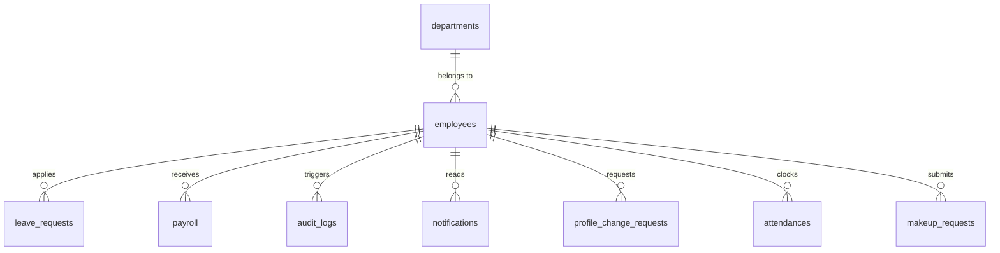
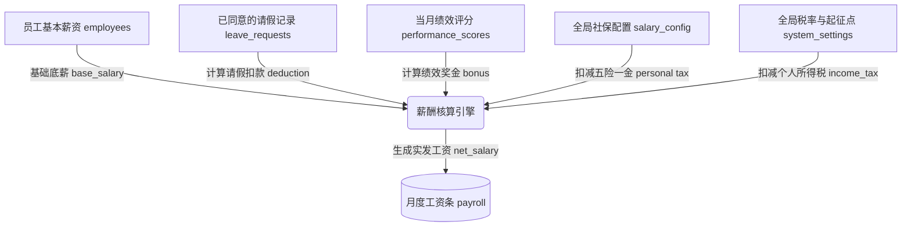

# 人事管理系统 — 软件需求规格说明书 (SRS)

> 版本：V2.0
> 日期：2026-05-18
> 项目代号：HRMS

---

## 目录

- [1 引言](#1-引言)
  - 1.1 目的
  - 1.2 范围
  - 1.3 定义、首字母缩写词与缩略语
  - 1.4 参考文献
  - 1.5 文档概述
- [2 总体描述](#2-总体描述)
  - 2.1 产品视角
  - 2.2 产品功能
  - 2.3 用户特征
  - 2.4 约束
  - 2.5 假设与依赖
- [3 具体需求](#3-具体需求)
  - 3.1 外部接口需求
  - 3.2 功能需求
  - 3.3 非功能需求
  - 3.4 数据需求
- [4 附录](#4-附录)

---

## 1 引言

### 1.1 目的

本文档旨在完整定义 **人力资源管理系统 (HRMS)** 的软件需求规格。目标读者包括：

- **开发人员**：作为编码与单元测试的依据
- **课程指导教师**：作为评审与打分的参考基线
- **后续维护者**：作为系统修改与扩展的需求溯源

### 1.2 范围

HRMS 是一套基于 C/S 架构的桌面端人事管理软件，覆盖以下业务域：

1. **员工档案管理**：员工基本信息的录入、修改、删除与查询
2. **考勤与请假审批**：员工请假申请提交与管理层审批流转
3. **薪酬核算**：基于考勤数据自动计算月度工资
4. **角色权限隔离**：管理员与普通员工的功能与数据可见性区分
5. **统计报表**：图表可视化与 PDF 导出
6. **操作审计**：全操作日志追踪

系统定位为单机 + 局域网 MySQL 数据库的轻量级部署，不涉及分布式、高并发或移动端场景。

### 1.3 定义、首字母缩写词与缩略语

| 术语 | 定义 |
|------|------|
| HRMS | Human Resource Management System，人力资源管理系统 |
| RBAC | Role-Based Access Control，基于角色的访问控制 |
| QODBC | Qt Open Database Connectivity，Qt 的 ODBC 数据库驱动 |
| C/S | Client/Server，客户端/服务器架构 |
| 管理员 (admin) | 拥有全部功能权限与全量数据可见性的系统角色 |
| 普通员工 (user) | 仅可查看自身数据、提交请假申请的系统角色 |

### 1.4 参考文献

- 《可行性分析报告.md》— 项目可行性论证
- IEEE 830-1998 — 软件需求规格说明书推荐实践
- Qt 6.5 官方文档 — https://doc.qt.io/qt-6/

### 1.5 文档概述

本文档其余部分结构如下：
- **第2章** 从宏观视角描述系统定位、用户角色与约束条件
- **第3章** 逐条定义外部接口、功能、非功能与数据需求
- **第4章** 附录（数据字典、UI 线框草图）

---

## 2 总体描述

### 2.1 产品视角

```
┌──────────────────────────────────────────────────────────┐
│                    HRMS 桌面客户端                         │
│  ┌──────────┐ ┌──────────┐ ┌───────────────────────────┐ │
│  │ 登录窗口  │ │ 主窗口    │ │ 五个功能 Tab               │ │
│  │          │ │ (QMainWin)│ │ (员工/请假/薪酬/日志/报表)   │ │
│  └──────────┘ └──────────┘ └───────────────────────────┘ │
│        │              │             │                     │
│        └──────────────┴─────────────┘                     │
│                      │ QODBC                             │
└──────────────────────┼───────────────────────────────────┘
                       │
              ┌────────┴────────┐
              │   MySQL 8.x     │
              │   hrms_db       │
              │  ┌───────────┐  │
              │  │ employees │  │
              │  │ leave_req │  │
              │  │ payroll   │  │
              │  │ audit_logs│  │
              │  └───────────┘  │
              └─────────────────┘
```

系统为典型 **两层 C/S 架构**：Qt Widgets 客户端 + MySQL 服务端。客户端通过 QODBC 驱动与数据库直连，无中间应用服务器。

### 2.2 产品功能

| 编号 | 功能模块 | 优先级 | 状态 | 简述 |
|------|---------|--------|------|------|
| F1 | 用户登录与认证 | 高 | 已实现 | 凭员工姓名或手机号 + 密码登录，登陆后获取角色权限 |
| F2 | 员工信息管理 | 高 | 已实现 | 管理员对 employees 表执行增删改查，手动提交/撤销 |
| F3 | 请假申请 | 高 | 已实现 | 填写起止日期与事由，提交请假请求 |
| F4 | 请假审批 | 高 | 已实现 | 管理员对 leave_requests 执行"同意"或"拒绝"操作 |
| F5 | 薪酬核算 | 高 | 已实现 | 管理员一键计算当月全员薪资，自动扣减已批准请假 |
| F6 | 权限隔离 (RBAC) | 高 | 已实现 | 根据角色控制 Tab 与按钮可见性、数据过滤 |
| F7 | 工资查询 | 中 | 已实现 | 员工在"薪酬管理"Tab 下查看个人历史工资条 |
| F8 | 多维筛选查询 | 中 | 已实现 | 按部门、在职状态、姓名组合筛选员工列表 |
| F9 | 统计报表 | 中 | 已实现 | 图表可视化（饼图/柱状图）+ PDF 导出 |
| F10 | 员工状态流转 | 中 | 已实现 | 管理员标记员工在职/离职，动态切换按钮文字 |
| F11 | 员工扩展字段 | 低 | 已实现 | 学历、婚姻状况、岗位三个扩展信息字段 |
| F12 | 用户密码修改 | 低 | 已实现 | 系统菜单 → 修改密码，旧密码验证 + 新密码更新 |
| F13 | 操作审计日志 | 低 | 已实现 | 全操作记录（登录/增删改/审批/核算/密码变更） |

### 2.3 用户特征

| 角色 | 技术熟练度 | 典型操作频率 | 职责范围 |
|------|-----------|-------------|---------|
| 管理员 (admin) | 中等，熟悉办公软件 | 每日/每周 | 管理全部员工档案、审批请假、核算薪资、查看报表与日志 |
| 普通员工 (user) | 基础，仅需点击操作 | 每月数次 | 查看个人信息与工资、提交请假申请、修改密码 |

#### 2.3.1 系统用例图 (Use Case Diagram)

以下是系统主要角色的用例分布图，清晰展示了普通员工与系统管理员的权限边界与功能交互：

```mermaid
graph LR
    subgraph 角色
        User[普通员工 user]
        Admin[管理员 admin]
    end

    subgraph 个人自助服务 (普通员工 & 管理员共有)
        F_Login[登录与身份认证]
        F_ModPwd[修改个人密码]
        F_ViewSalary[查询个人工资条]
        F_ApplyLeave[提交请假申请]
        F_ProfileChange[申请修改个人信息]
    end

    subgraph 后台管理服务 (仅管理员拥有)
        F_EmpCrud[员工档案增删改查]
        F_ApproveLeave[审批请假单]
        F_ApproveChange[审批信息变更]
        F_CalcSalary[一键核算全员薪资]
        F_Config[配置全局社保比例]
        F_Audit[查询系统操作审计日志]
        F_Charts[查看多维报表统计]
    end

    User --> F_Login
    User --> F_ModPwd
    User --> F_ViewSalary
    User --> F_ApplyLeave
    User --> F_ProfileChange

    Admin --> User
    Admin --> F_EmpCrud
    Admin --> F_ApproveLeave
    Admin --> F_ApproveChange
    Admin --> F_CalcSalary
    Admin --> F_Config
    Admin --> F_Audit
    Admin --> F_Charts
```

### 2.4 约束

- **技术约束**：C++17 + Qt 6.5 + MySQL 8.x + MinGW 64-bit (Windows)
- **部署约束**：客户端与数据库必须在同一局域网内，不支持公网部署
- **安全约束**：SQL 全程参数化查询防注入；密码采用 SHA-256 哈希存储；config.ini 数据库密码 Base64 编码
- **许可约束**：Qt 使用 LGPL v3 开源版，仅用于教学与非商业用途

### 2.5 假设与依赖

- 假设 MySQL 服务已安装并运行在局域网可达的 IP
- 假设 `hrms_db` 数据库及四张表 (`employees`, `leave_requests`, `payroll`, `audit_logs`) 已初始化或可自动建表
- 假设 MySQL ODBC 驱动 (9.6 UNICODE) 已在 Windows 上正确注册
- 假设操作系统中文字体已安装，界面中文无乱码
- 数据库连接参数通过 `config.ini` 外部配置

---

## 3 具体需求

### 3.1 外部接口需求

#### 3.1.1 用户界面

**登录窗口 (LoginWindow)**

| 元素 | 类型 | 说明 |
|------|------|------|
| 账号输入框 | QLineEdit | 接受姓名或手机号 |
| 密码输入框 | QLineEdit (Password) | 输入回显为掩码字符 |
| 登录按钮 | QPushButton | 触发身份验证 |

**主窗口 (MainWindow)** — 含 5 个 QTabWidget 标签页 + 系统菜单 + 状态栏：

*Tab 1 — 员工信息管理 (仅 admin 可见)*

| 元素 | 类型 | 说明 |
|------|------|------|
| 筛选栏 | QHBoxLayout | 部门下拉框 + 状态下拉框 + 姓名搜索框 + 查询/重置按钮 |
| 员工表格 | QTableView | 绑定 QSqlTableModel，隐藏密码列，双击可编辑 |
| 添加员工按钮 | QPushButton | 在表尾插入空行 |
| 删除选中行按钮 | QPushButton | 标记删除当前选中行（需手动保存） |
| 撤销修改按钮 | QPushButton | 放弃所有未提交的修改 |
| 保存修改按钮 | QPushButton | 将所有修改批量提交到数据库 |
| 标记离职/在职按钮 | QPushButton | 动态切换选中员工的在职状态 |

*Tab 2 — 考勤与请假审批*

| 元素 | 类型 | 说明 |
|------|------|------|
| 请假单表格 | QTableView | 绑定 QSqlRelationalTableModel（emp_id 关联显示为姓名），只读 |
| 开始日期标签 | QLabel | "开始日期:" |
| 开始日期选择器 | QDateEdit | 带日历弹窗 |
| 结束日期标签 | QLabel | "结束日期:" |
| 结束日期选择器 | QDateEdit | 带日历弹窗 |
| 事由标签 | QLabel | "事由:" |
| 请假事由输入框 | QLineEdit | 自由文本 |
| 我要请假按钮 | QPushButton | 提交申请 |
| 同意按钮 | QPushButton | 仅 admin 可见 |
| 拒绝按钮 | QPushButton | 仅 admin 可见 |

*Tab 3 — 薪酬管理*

| 元素 | 类型 | 说明 |
|------|------|------|
| 工资条表格 | QTableView | 绑定 QSqlRelationalTableModel（emp_id 关联显示为姓名），只读 |
| 一键核算按钮 | QPushButton | 仅 admin 可见，触发当月薪资批量计算 |

*Tab 4 — 操作日志 (仅 admin 可见)*

| 元素 | 类型 | 说明 |
|------|------|------|
| 日志表格 | QTableView | 绑定 QSqlTableModel，只读，按时间倒序排列 |

*Tab 5 — 统计报表 (仅 admin 可见)*

| 元素 | 类型 | 说明 |
|------|------|------|
| 图表区域 | QChartView | 渲染饼图或柱状图，抗锯齿渲染 |
| 图表类型下拉框 | QComboBox | 切换：部门人数分布/在职离职比例/各部门平均薪资/月度请假统计 |
| 导出PDF按钮 | QPushButton | 将当前图表渲染导出为 A4 横向 PDF |

**系统菜单**

| 菜单项 | 说明 |
|------|------|
| 系统 → 修改密码 | 弹出密码修改对话框 |
| 系统 → 退出登录 | 关闭主窗口，返回登录窗口 |

**状态栏**

显示格式：`当前用户: {姓名} | 角色: {管理员/普通员工}`

**密码修改对话框 (ChangePasswordDialog)**

| 元素 | 类型 | 说明 |
|------|------|------|
| 旧密码输入框 | QLineEdit (Password) | 用于验证身份 |
| 新密码输入框 | QLineEdit (Password) | 新密码 |
| 确认密码输入框 | QLineEdit (Password) | 二次确认 |
| 确认修改按钮 | QPushButton | 校验后更新数据库 |
| 取消按钮 | QPushButton | 关闭对话框 |

#### 3.1.2 软件接口

| 接口 | 协议/驱动 | 说明 |
|------|----------|------|
| MySQL 数据库 | ODBC (MySQL ODBC 9.6 UNICODE Driver) | TCP 连接，端口配置于 config.ini |
| Qt SQL 模块 | QSqlDatabase / QSqlQuery | C++ API，参数化 SQL |
| Qt Charts 模块 | QChartView / QPieSeries / QBarSeries | 统计图表渲染 |
| QPdfWriter | Qt6::Gui 内置 | PDF 文件导出 |

#### 3.1.3 硬件接口

无特殊硬件要求。标准 PC（x86-64, ≥8GB RAM, Windows 10/11）即可运行。

### 3.2 功能需求

#### FR-1：用户登录与认证

**触发条件**：用户启动应用程序

**输入**：
- 账号（字符串，支持姓名或手机号）
- 密码（字符串，明文字符）

**处理流程**：
1. 校验账号、密码字段非空
2. 执行 SQL 查询：`SELECT emp_id, name, role FROM employees WHERE (name = :account OR phone = :account) AND password_hash = :password`
3. 若命中记录 → 登录成功，进入主窗口
4. 若无命中 → 显示错误提示 "账号或密码错误"

**输出**：
- 成功：弹窗欢迎信息，打开 MainWindow（传入 empId 和 role），关闭登录窗口
- 失败：弹窗错误提示

**异常处理**：
- 数据库连接失败 → 由 main.cpp 捕获，显示 "数据库连接失败！"，终止程序

---

#### FR-2：员工信息管理

**前置条件**：当前用户角色为 `admin`

**2.1 查看员工列表**
- 系统以表格形式展示 `employees` 表所有记录
- 列：员工编号、姓名、性别、联系电话、所属部门、系统角色、基础薪资、入职日期、在职状态、学历、婚姻状况、岗位
- `password_hash` 列隐藏

**2.2 多维筛选查询**
- 触发：选择筛选条件后点击 "查询"，或点击 "重置" 清除过滤
- 筛选维度：部门（下拉选择）、在职状态（在职/离职/全部）、姓名（模糊搜索）
- 行为：调用 `empModel->setFilter()` 拼接 AND 条件，自动刷新表格

**2.3 添加员工**
- 触发：点击 "添加员工" 按钮
- 行为：在表格末尾插入新空行，自动滚动并选中
- 新行数据暂存于内存，不立即写入数据库

**2.4 删除员工**
- 触发：选中目标行 → 点击 "删除选中行"
- 校验：若未选中任何行 → 弹窗提示
- 行为：从界面移除该行（标记删除），不立即从数据库删除

**2.5 员工状态流转**
- 触发：选中目标行 → 点击 "标记离职" 或 "标记在职"
- 校验：若未选中任何行 → 弹窗提示
- 行为：切换该员工的 `status` 字段（在职 ↔ 离职），按钮文字动态更新
- 状态变更暂存于内存，需点击"保存修改"提交

**2.6 保存修改**
- 触发：点击 "保存修改" 按钮
- 行为：调用 `submitAll()`，所有增、删、改批处理提交至 MySQL
- 成功/失败弹窗反馈

**2.7 撤销修改**
- 触发：点击 "撤销修改" 按钮
- 行为：调用 `revertAll()`，放弃所有未提交的内存修改

---

#### FR-3：请假申请

**前置条件**：用户已登录（admin 或 user 均可）

**触发条件**：用户填写请假起止日期与事由后，点击 "我要请假"

**输入**：
- 开始日期 (QDate)
- 结束日期 (QDate)
- 请假事由 (String)

**校验规则**：
- 开始日期不得晚于结束日期，否则提示
- 请假事由不得为空，否则提示

**处理流程**：
1. 通过校验后，执行 `INSERT INTO leave_requests (emp_id, start_date, end_date, reason, status) VALUES (:emp_id, :start, :end, :reason, '待审批')`
2. `status` 字段初始值为 `待审批`，无需用户指定

**输出**：
- 成功：弹窗提示成功，刷新请假表，清空事由输入框
- 失败：弹窗数据库错误详情

**权限补充**：普通员工的请假表格仅显示自身记录

---

#### FR-4：请假审批

**前置条件**：当前用户角色为 `admin`

**4.1 同意请假**
- 触发：选中请假单 → 点击 "同意"
- 校验：未选中行时弹窗提示并返回（已修复防崩溃 Bug）
- 执行：`UPDATE leave_requests SET status = '已同意' WHERE request_id = ?`

**4.2 拒绝请假**
- 触发：选中请假单 → 点击 "拒绝"
- 校验：未选中行时弹窗提示并返回
- 执行：`UPDATE leave_requests SET status = '已拒绝' WHERE request_id = ?`

**输出**：弹窗反馈操作结果，自动刷新请假表格

---

#### FR-5：薪酬核算

**前置条件**：当前用户角色为 `admin`

**触发条件**：点击 "一键核算本月工资"

**处理流程**：
1. 获取当前月份 `yyyy-MM`
2. 检查 `payroll` 表当月是否已有记录：
   - 若存在 → 弹窗确认覆盖
   - 用户确认 "是" → 删除当月旧记录
   - 用户选择 "否" → 终止本次核算
3. 遍历 `employees` 表所有员工，对每个员工：
   a. 查询当月所有 `status = '已同意'` 的请假总天数
   b. 计算扣款 = `(base_salary / 21.75) * leaveDays`
   c. 计算实发 = `base_salary - deduction`
   d. 插入 payroll 记录
4. 全部处理完成后弹窗汇总结果

**计算参数说明**：
- 月计薪天数固定为 **21.75** 天（中国法定标准）
- 扣款 = 基础工资 / 21.75 × 当月已同意请假天数

---

#### FR-6：角色权限隔离 (RBAC)

**权限矩阵**：

| 功能/Tab | admin | user |
|----------|-------|------|
| Tab 0 员工信息管理 | 可见、可编辑 | **隐藏** |
| Tab 3 操作日志 | 可见（只读） | **隐藏** |
| Tab 4 统计报表 | 可见 | **隐藏** |
| 请假审批按钮（同意/拒绝） | 可见、可用 | **隐藏** |
| 一键核算按钮 | 可见、可用 | **隐藏** |
| 请假申请按钮 | 可见、可用 | 可见、可用 |
| 请假表格数据范围 | 全部员工 | `WHERE emp_id = 当前用户` |
| 工资表格数据范围 | 全部员工 | `WHERE emp_id = 当前用户` |
| 系统菜单 → 修改密码 | 可见、可用 | 可见、可用 |
| 系统菜单 → 退出登录 | 可见、可用 | 可见、可用 |

---

#### FR-7：密码修改

**前置条件**：用户已登录

**触发条件**：系统菜单 → 修改密码

**处理流程**：
1. 弹出 ChangePasswordDialog 对话框
2. 输入旧密码、新密码、确认新密码
3. 校验：旧密码非空、新密码非空、两次新密码一致
4. 查询数据库验证旧密码正确
5. 执行 `UPDATE employees SET password_hash = ? WHERE emp_id = ?`
6. 弹窗反馈结果

---

#### FR-8：统计报表与 PDF 导出

**前置条件**：当前用户角色为 `admin`

**触发条件**：切换到"统计报表"Tab

**图表类型**：
| 编号 | 名称 | 图表类型 | 数据来源 |
|------|------|---------|---------|
| 1 | 部门人数分布 | 饼图 (QPieSeries) | `SELECT department, COUNT(*) FROM employees GROUP BY department` |
| 2 | 在职/离职比例 | 饼图 (QPieSeries) | `SELECT status, COUNT(*) FROM employees GROUP BY status` |
| 3 | 各部门平均薪资 | 柱状图 (QBarSeries) | `SELECT department, AVG(base_salary) FROM employees GROUP BY department` |
| 4 | 月度请假统计 | 柱状图 (QBarSeries) | `SELECT DATE_FORMAT(start_date, '%Y-%m'), COUNT(*) FROM leave_requests GROUP BY 1` |

**切换方式**：下拉框选择，图表实时切换（带动画效果）

**PDF 导出**：
- 点击 "导出PDF" → 弹出 QFileDialog 选择路径
- 使用 QPdfWriter + QPainter 将当前 QChartView 渲染为 A4 横向 PDF
- 分辨率 300 DPI

---

#### FR-9：操作审计日志

**前置条件**：当前用户角色为 `admin`

**审计内容**：`audit_logs` 表自动记录以下操作：

| 操作 | 记录时机 |
|------|---------|
| 用户登录 | MainWindow 初始化时 |
| 退出登录 | 系统菜单 → 退出登录时 |
| 新增员工记录 | 点击"添加员工"时 |
| 删除员工记录 | 点击"删除选中行"时（含被删员工姓名）|
| 保存员工信息修改 | 点击"保存修改"成功时 |
| 提交请假申请 | 请假成功提交时（含日期范围）|
| 同意请假 | 点击"同意"时（含请假单号）|
| 拒绝请假 | 点击"拒绝"时（含请假单号）|
| 核算工资 | 一键核算完成时（含月份与人数）|
| 修改密码 | 密码更新成功时 |
| 变更员工状态 | 标记离职/在职时（含目标员工姓名与新状态）|

**查看方式**：切换到"操作日志"Tab，只读表格按时间倒序显示，隐藏 emp_id 列

---

### 3.3 非功能需求

#### NFR-1：性能
- 客户端启动时间 ≤ 3 秒（含数据库连接与建表迁移）
- 表格数据加载 ≤ 2 秒（1000 条记录以内）
- 薪酬核算完成 ≤ 5 秒（50 名员工以内）
- 图表渲染 ≤ 2 秒

#### NFR-2：可用性
- 所有界面元素以简体中文标注
- 所有操作结果（成功/失败）有明确的弹窗反馈
- 表格双击即可进入编辑模式，符合办公软件习惯
- 窗口缩放时控件通过布局管理器自适应
- 请假审批未选中行时有防崩溃保护

#### NFR-3：安全性
- SQL 注入防护：全部 SQL 使用参数化查询（`prepare` + `bindValue`）
- 权限校验：客户端层面根据 `currentRole` 控制 UI 可见性与数据过滤
- 密码在 UI 层面回显掩码（`QLineEdit::Password`）
- 后续迭代计划：密码存储改为 SHA-256 哈希（当前为明文存储）

#### NFR-4：可维护性
- 代码遵循 Model-View 分离：Model 层（QSqlTableModel/QSqlRelationalTableModel）、View 层（QTableView/QChartView）、Control 层（MainWindow 槽函数）
- 遵循 Qt 命名规范：UI 控件命名为 `btn*` / `tableView_*` / `lineEdit_*` / `dateEdit_*`
- 数据库迁移采用幂等设计（`CREATE TABLE IF NOT EXISTS`、`SHOW COLUMNS` 检查后 `ALTER`）

#### NFR-5：可靠性
- 数据库连接失败时程序终止并打印错误信息
- 数据修改采用 `OnManualSubmit` 策略，用户可撤销未提交的误操作
- 重复核算当月工资前弹出二次确认
- 扩展字段添加前检查列是否存在，防止重复迁移报错

### 3.4 数据需求

以下为系统实体关系图 (E-R 图)：




#### 3.4.1 employees 表

| 字段 | 类型 | 约束 | 说明 |
|------|------|------|------|
| emp_id | INT | PK, AUTO_INCREMENT | 员工编号 |
| name | VARCHAR(50) | NOT NULL | 姓名 |
| gender | VARCHAR(10) | - | 性别 |
| phone | VARCHAR(20) | - | 联系电话（可用于登录） |
| department | VARCHAR(50) | - | 所属部门 |
| role | VARCHAR(20) | NOT NULL | 系统角色：admin / user |
| password_hash | VARCHAR(255) | NOT NULL | 密码（当前明文，后续改为哈希） |
| base_salary | DECIMAL(10,2) | - | 基础薪资 |
| hire_date | DATE | - | 入职日期 |
| status | VARCHAR(20) | DEFAULT '在职' | 在职状态 |
| education | VARCHAR(20) | DEFAULT '' | 学历（F11 扩展字段） |
| marital_status | VARCHAR(20) | DEFAULT '' | 婚姻状况（F11 扩展字段） |
| position | VARCHAR(50) | DEFAULT '' | 岗位（F11 扩展字段） |

#### 3.4.2 leave_requests 表

| 字段 | 类型 | 约束 | 说明 |
|------|------|------|------|
| request_id | INT | PK, AUTO_INCREMENT | 请假单号 |
| emp_id | INT | FK → employees.emp_id | 申请人编号 |
| start_date | DATE | NOT NULL | 请假开始日期 |
| end_date | DATE | NOT NULL | 请假结束日期 |
| reason | TEXT | - | 请假事由 |
| status | VARCHAR(20) | DEFAULT '待审批' | 审批状态：待审批 / 已同意 / 已拒绝 |

#### 3.4.3 payroll 表

| 字段 | 类型 | 约束 | 说明 |
|------|------|------|------|
| payroll_id | INT | PK, AUTO_INCREMENT | 工资条ID |
| emp_id | INT | FK → employees.emp_id | 员工编号 |
| month | VARCHAR(7) | NOT NULL | 薪资月份 (yyyy-MM) |
| base_salary | DECIMAL(10,2) | - | 基础工资 |
| leave_deduction | DECIMAL(10,2) | DEFAULT 0.00 | 请假扣款 |
| net_salary | DECIMAL(10,2) | - | 实发最终工资 |
| issue_date | DATE | - | 结算发薪日期 |

#### 3.4.4 audit_logs 表

| 字段 | 类型 | 约束 | 说明 |
|------|------|------|------|
| log_id | INT | PK, AUTO_INCREMENT | 日志编号 |
| emp_id | INT | FK → employees.emp_id | 操作人编号 |
| emp_name | VARCHAR(50) | NOT NULL | 操作人姓名（冗余便于查看） |
| action | VARCHAR(100) | NOT NULL | 操作动作 |
| target | VARCHAR(200) | DEFAULT '' | 操作对象 |
| log_time | DATETIME | DEFAULT CURRENT_TIMESTAMP | 操作时间 |

---

## 4 附录

### 4.1 窗口流程图

```
main() 启动
  │
  ├── 读取 config.ini（多路径查找）
  ├── 连接 MySQL (QODBC)
  │     ├── 失败 → 打印错误，return -1
  │     └── 成功 ↓
  │
  ├── 显示 LoginWindow
  │     ├── 用户输入账号+密码
  │     └── SQL 查询匹配
  │           ├── 无结果 → "账号或密码错误"
  │           └── 有结果 → new MainWindow(empId, role)
  │                         → 显示 MainWindow, 关闭 LoginWindow
  │
  └── MainWindow
        ├── 自动建表（audit_logs）+ 扩展字段迁移（F11）
        ├── 查询当前用户姓名
        ├── 写入登录日志
        ├── role == "admin"：全部 Tab 可见（含 Tab 0/3/4）
        └── role == "user"：
              ├── 隐藏 Tab 0 (员工信息管理)
              ├── 隐藏 Tab 3 (操作日志)
              ├── 隐藏 Tab 4 (统计报表)
              ├── 隐藏 审批按钮、核算按钮
              ├── leave & payroll 表过滤为自身 emp_id
              └── 系统菜单可见（修改密码、退出登录）
```

### 4.2 请假-薪酬业务数据流




### 4.3 源码文件清单

| 文件 | 说明 |
|------|------|
| `main.cpp` | 入口：读取 config.ini、连接数据库、启动 LoginWindow |
| `loginwindow.h/cpp/ui` | 登录窗口：账号密码验证、角色提取、跳转主窗口 |
| `mainwindow.h/cpp/ui` | 主窗口：5 个 Tab、系统菜单、状态栏、全部业务逻辑 |
| `changepassworddialog.h/cpp` | 密码修改对话框 |
| `CMakeLists.txt` | CMake 构建配置 (Qt6 Core/Gui/Widgets/Sql/Charts) |
| `config.ini` | 数据库连接配置（不纳入版本控制） |
| `auditlog.sql` | 审计日志表 DDL |

### 4.4 已知后续改进项

| 编号 | 内容 | 优先级 |
|------|------|--------|
| P1 | 密码 SHA-256 哈希存储 | 高（已完成）|
| P2 | 员工表/工资表 CSV 导出 | 中 |
| P3 | 仪表盘首页（汇总卡片） | 低 |
| P4 | 部门独立成表（下拉选择替代手填） | 低 |

---

*本文档基于代码审查（全部源码文件）及《可行性分析报告.md》编写。V2.0 更新于 2026-05-18，反映全部 F1-F13 需求实现状态。*
