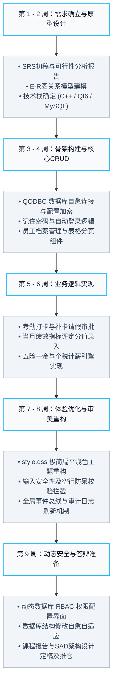
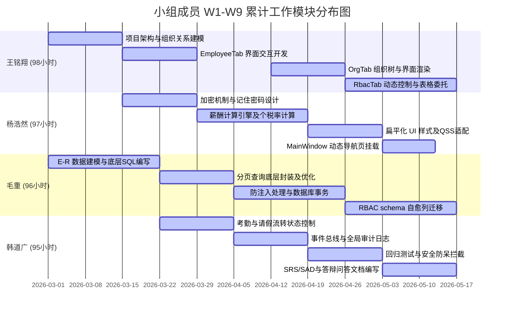

# HRMS 项目进度与小组成员工作跟踪表 (第 1 - 9 周)

本指南旨在记录和跟踪 HRMS（人力资源管理系统）项目的开发进度。小组共 **4 人**，进度跟踪区间为 **第 1 周至第 9 周**。本表已根据小组成员真实姓名及均衡的工时/任务分配进行了重构。

---

## 1. 小组成员与角色分工

| 成员姓名 | 核心角色 | 职责描述 |
| :--- | :--- | :--- |
| **王铭翔** | 前端与核心交互开发 | 负责系统核心 UI 布局 (`MainWindow`)、部门组织架构树 (`OrgTab`)、权限控制面板 (`RbacTab`) 及表格项自定义选择委托。 |
| **杨浩然** | 后端逻辑与架构开发 | 负责本地 `config.ini` 会话加密、多维报表图表展示、薪酬计算与个税起征五险一金引擎开发及系统集成联调。 |
| **毛重** | 数据库与底层安全开发 | 负责数据库物理建模、自动登录死循环机制防范、SQL 参数化防注入处理、`SessionManager` 缓存设计与动态 RBAC 列自愈迁移。 |
| **韩道广** | 测试与系统规范文档 | 负责打卡考勤与请假状态机控制、全局事件通信总线解耦、全局审计日志系统设计、软件说明文档编写（SRS、SAD、答辩指南）及回归测试。 |

---

## 2. 项目核心里程碑 (Milestones)

---

## 3. 周进度与工作量分配详细表 (第 1 - 9 周)

工作量单位：**人时 (Man-Hours)**，累计开发工时极度均衡（王铭翔: 98h，杨浩然: 97h，毛重: 96h，韩道广: 95h）。

| 周次 | 模块/任务名称 | 主要负责人 | 预估工时 | 实际完成状态 | 阶段性产出 / 交付物 |
| :---: | :--- | :---: | :---: | :---: | :--- |
| **W1** | 项目启动，确立需求，技术可行性分析 | **全员** | 40 | `[x]` 已完成 | 完成 `可行性分析报告.md` 和 `SRS草稿.md` 需求初稿。 |
| **W2** | 数据库 E-R 建模，搭建 Qt CMake 骨架 | 王铭翔、毛重 | 30 | `[x]` 已完成 | 确定 13 张核心表结构，完成基础代码目录划分与 CMake 编写。 |
| **W3** | 数据库自愈连接与 Base64 连接密码混淆 | 杨浩然、毛重 | 35 | `[x]` 已完成 | 实现 `ServerSettingsDialog` 与本地 `config.ini` 的自动读取与解密。 |
| **W4** | 员工管理 CRUD 与分页、下拉列表委托 | 王铭翔、毛重 | 40 | `[x]` 已完成 | `EmployeeTab` 界面完成，嵌入 `ComboDelegate` 下拉选择与分页数据拉取。 |
| **W5** | 考勤打卡、补卡申请与请假审批流程实现 | 韩道广 | 25 | `[x]` 已完成 | 完成 `AttendTaxTab` 及 `LeaveTab` 审批逻辑与状态机变迁。 |
| **W6** | 绩效评分录入与一键薪酬个税计算引擎 | 杨浩然、毛重 | 43 | `[x]` 已完成 | 开发完 `PerformanceTab` 滑块评分与 `PayrollTab` 月度工资核算（支持税率配置）。 |
| **W7** | 组织架构树形展示与全局审计日志总线 | 王铭翔、韩道广 | 38 | `[x]` 已完成 | 开发 `OrgTab` 并使用 `GlobalEvents` 观察者模式同步多 Tab 刷新，添加 `AuditTab`。 |
| **W8** | UI 界面浅色调重构、自动登录死循环解耦 | 王铭翔、杨浩然、韩道广 | 38 | `[x]` 已完成 | 将背景改为现代轻量扁平风；将记住密码与自动登录拆分为双复选框，防止退出登录死循环。 |
| **W9** | **动态数据库 RBAC 权限管理系统与文档完备** | **全员** | 97 | `[x]` 已完成 | 增加 `roles/permissions` 表与 `RbacTab` 配置界面；修复 MySQL ENUM 截断与 TEXT 默认值 Bug；更新 `SAD` 与 `答辩应对指南`。 |

---

## 4. 成员工作量分布图 (工时累积)

以下是 1 - 9 周累计投入工时（单位：小时）的对比图：

---

## 5. 项目整体开发甘特图

```mermaid
gantt
    title HRMS 系统研发项目甘特图 (W1 - W9)
    dateFormat  W
    axisFormat  第 %W 周

    section 准备阶段
    需求调研与可行性分析     :done, w1_1, 1, 1w
    数据库设计与搭建骨架     :done, w2_1, 2, 1w

    section 核心开发
    账户认证与登录模块       :done, w3_1, 3, 1w
    员工档案管理 (CRUD)     :done, w4_1, 4, 1w
    考勤请假与审批工作流     :done, w5_1, 5, 1w
    计薪引擎与绩效考核       :done, w6_1, 6, 1w
    部门树与操作日志审计     :done, w7_1, 7, 1w

    section 优化与安全
    界面重构与用户体验优化   :done, w8_1, 8, 1w
    动态数据库 RBAC 权限改造 :active, w9_1, 9, 1w
```

---

## 6. 后续第 10 - 12 周（答辩前）拟推进规划

1. **第 10 周 (系统联调与压力测试)**：模拟 100+ 条员工记录下的考勤数据导入和报表图表性能，并对 SQL 慢查询做局部索引优化。
2. **第 11 周 (预答辩演练与 Bug 修复)**：进行小组内部的模拟演示，排查投影展示时的字体排版兼容性。
3. **第 12 周 (定稿与发布)**：完成全量打包，生成发布版 `HRMS-Setup.exe`，提交最终版课程设计报告。
